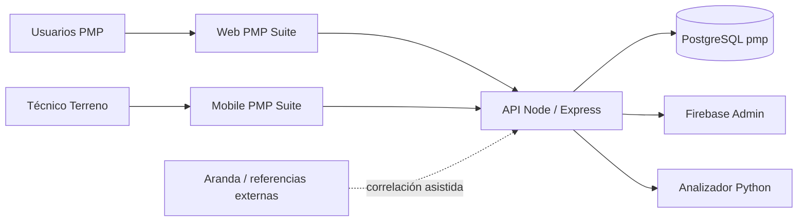

# 1. Contexto del sistema

**Versión:** V2.0

## Objetivo

PMP Suite centraliza trazabilidad y mantenimiento de validadores y consolas a través de Terreno, Bodega, Laboratorio y QA.

## Actores

| Actor | Interacción |
|---|---|
| Gerente | Supervisión ejecutiva de solo lectura |
| Administrador | Usuarios, roles, seguridad y supervisión global |
| Jefe Laboratorio | Custodia, asignación y supervisión de Laboratorio |
| Logística | Bodega, inventario, repuestos, retiros y despachos |
| QA | Recepción, pruebas, dictamen y despacho QA |
| Técnico Laboratorio | Trabajo técnico sobre su carga |
| Técnico Terreno | Fallas, retiro e instalación |
| Firebase | Proveedor de identidad |
| PostgreSQL | Persistencia y autoridad operacional |
| Aranda/u otro externo | Referencia correlacionada; no integración automática en el Capstone |

## Contexto C4 simplificado

## Límites

- PMP Suite no asume una integración automática con Aranda.
- Consultar una pantalla no cambia custodia.
- Analítica no ejecuta decisiones ni movimientos.
- Admin no reemplaza a los actores operacionales.
