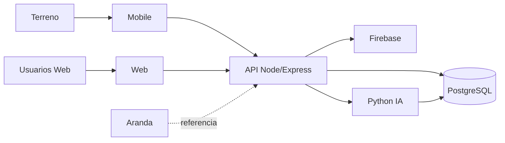

# Arquitectura 01 — Contexto V2.0

**Versión:** V2.0

## Problema

PMP Suite centraliza un proceso donde la información de validadores/consolas estaba fragmentada entre áreas, planillas, correos, guías y registros técnicos, dificultando determinar identidad, custodia, estado e historial.

Detalle: `Documentacion Capstone/00_PROBLEMATICA_Y_CONTEXTO_V2.0.md`.

## Actores

| Actor | Interacción |
|---|---|
| Gerente | supervisión ejecutiva de solo lectura |
| Admin | usuarios, seguridad y supervisión |
| Jefe Laboratorio | recepción, asignación, SLA y salida Lab |
| Logística | Bodega, inventario, repuestos y movimientos |
| QA | recepción, Ambiente, pruebas, dictamen y salida |
| Técnico Lab | diagnóstico/reparación/pruebas |
| Técnico Terreno | fallas, retiro e instalación |
| Firebase | identidad |
| PostgreSQL | persistencia/rol efectivo |
| Analizador Python | priorización de reincidencia |
| Aranda | referencia externa asistida, no integración automática |

## Contexto

## Límite del sistema

PMP Suite comienza en el registro/operación de activos y controla las intervenciones/movimientos que se confirman en su flujo. No reemplaza procesos externos no integrados automáticamente.

## Principios

- tipo+serie;
- Physical First;
- RBAC;
- historial append-only;
- caso ≠ OS ≠ activo ≠ referencia;
- error ≠ ausencia de datos.
