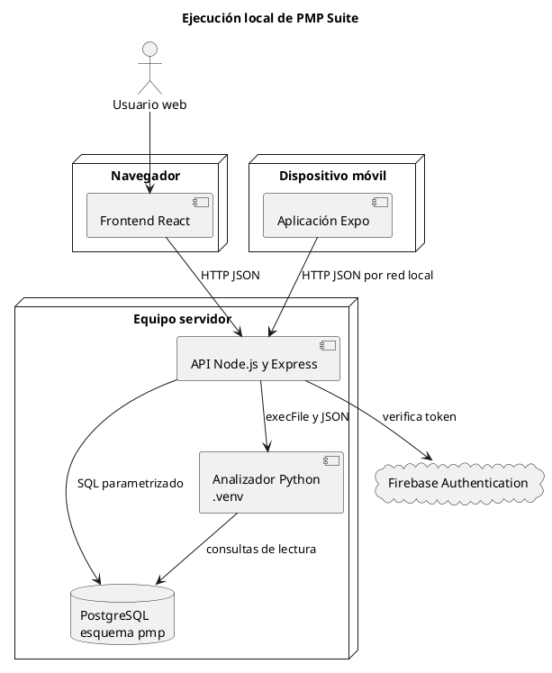

# Arquitectura de ejecución local

## Propósito

Esta vista describe la forma comprobada de ejecutar PMP Suite para desarrollo y
demostración Capstone. Todos los componentes se levantan desde el proyecto
oficial y se comunican mediante la red local.

## Nodos

- **Equipo servidor:** ejecuta PostgreSQL, la API Node.js y el entorno Python de
  inteligencia operacional.
- **Navegador:** ejecuta el frontend React servido por Vite.
- **Dispositivo móvil:** ejecuta la aplicación Expo y accede a la API mediante la
  dirección IP local del equipo servidor.
- **Firebase:** autentica las cuentas de usuario. El backend verifica cada token
  con Firebase Admin.

## Puertos y comunicación

| Componente | Dirección de referencia | Función |
|---|---|---|
| API REST | `http://localhost:4000` | Autenticación, reglas de negocio y acceso a datos |
| Salud API | `http://localhost:4000/api/health` | Comprobación del proceso backend |
| Frontend web | `http://localhost:5173` | Interfaz React durante desarrollo |
| PostgreSQL | Configurado en `DATABASE_URL` | Persistencia del esquema `pmp` |
| Mobile | `http://IP_LOCAL:4000/api` | Acceso desde un dispositivo conectado a la misma red |

## Variables

El backend requiere `PORT`, `DATABASE_URL` y
`FIREBASE_SERVICE_ACCOUNT_PATH`. El frontend requiere la URL de la API y las
variables públicas del cliente Firebase. Los valores sensibles permanecen en
archivos `.env` ignorados por Git y la credencial administrativa se almacena
fuera del repositorio.

## Diagrama PlantUML

## Secuencia de inicio

1. Iniciar PostgreSQL y comprobar la base configurada.
2. Iniciar la API desde `03_Backend/pmp-api` con `npm run dev`.
3. Consultar `GET /api/health`.
4. Iniciar el frontend desde `04_Frontend` con `npm run dev`.
5. Para mobile, configurar la IP local del backend e iniciar Expo desde
   `07_Mobile` con `npm start`.

## Criterio de validación

La ejecución se considera aprobada cuando la API responde salud, el frontend
carga, una cuenta válida obtiene su perfil desde `/api/auth/me`, PostgreSQL
entrega el rol efectivo y el dispositivo móvil puede alcanzar la API desde la
red local.
