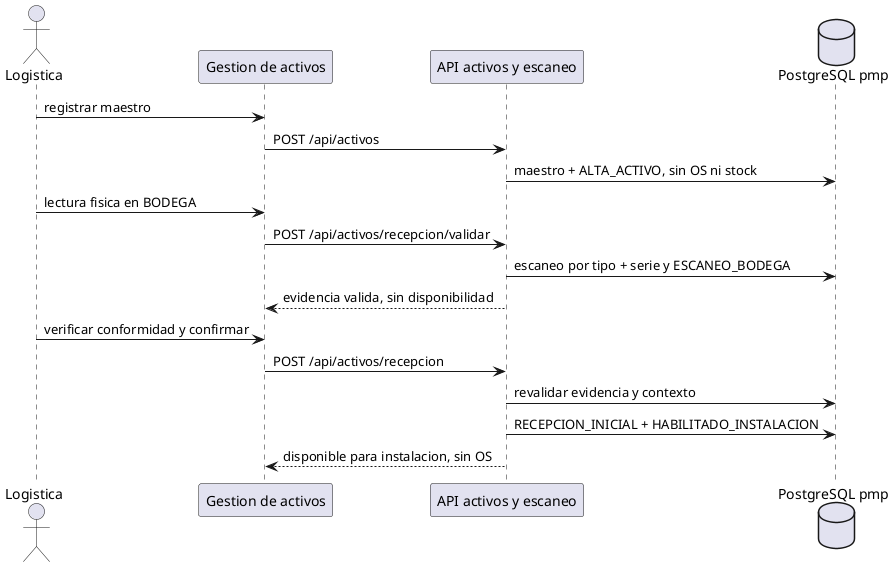
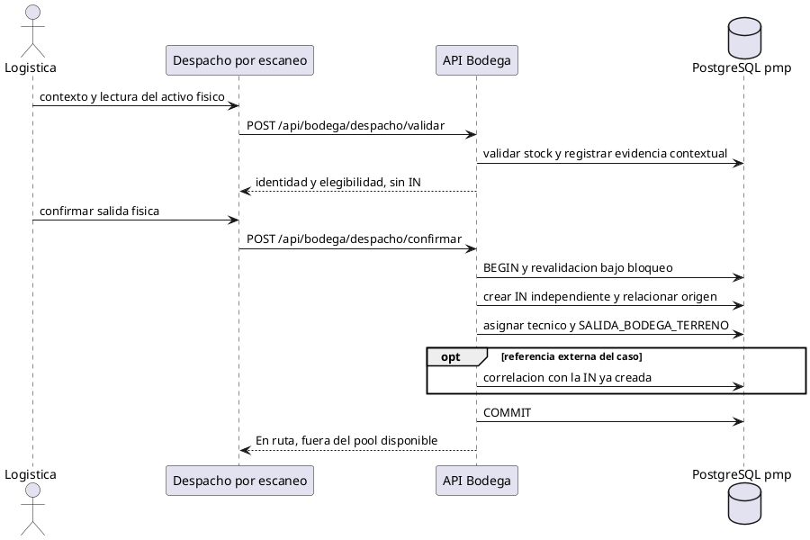

# Flujos de datos de PMP Suite

Actualización documental: 23 de septiembre de 2026. Esta vista complementa la [línea base Capstone v2.0](../Documentacion%20Capstone/Artefactos%20Metodologia%20Cascada/README_VIGENCIA_v2.0.md) y la [adenda funcional](CASOS_REQUERIMIENTOS_DESPACHO.md). No registra una nueva ejecución de pruebas.

## 1. Autenticación y autorización

Web y Mobile obtienen un ID token de Firebase Client. La API verifica identidad con Firebase Admin, consulta usuario activo y rol en PostgreSQL y aplica restricciones de lectura, rol y asignación. Los Custom Claims y la interfaz no sustituyen autorización backend.

## 2. Alta y recepción inicial sin OS

Gestión de activos registra maestro por tipo + serie, datos técnicos conocidos, origen, fecha, observación y autor. Guarda ALTA_ACTIVO transaccionalmente sin crear caso, OS, instalación, stock ni aprobación QA.

Recepcionar activo nuevo exige lectura física válida en la ubicación BODEGA y conformidad inicial explícita. La consulta manual no habilita recepción. El escaneo y ESCANEO_BODEGA conservan activo, usuario, fecha y contexto sin OS. Confirmar revalida la evidencia y registra RECEPCION_INICIAL y HABILITADO_INSTALACION en una transacción. No se utiliza bus ficticio ni diagnóstico/reparación/QA de reparación.

## 3. Requerimientos y reparación

Requerimientos sugiere activos por bus y permite búsqueda por serie. La API revalida identidad existente y vínculo operacional con el bus. Un desconocido se rechaza sin crear maestro, caso, OS ni correlación.

Confirmar crea caso y OS MV/MC/PDV/PDC según el proceso; conserva la referencia externa textual y su correlación cuando existe. **Bridge solo vincula referencias con OS existentes:** no crea órdenes, asigna técnicos, cambia estados ni mueve stock.

La reparación conserva OS y activo durante retiro, Bodega, laboratorio, QA y retorno físico. Cada handler operacional comprueba estado previo, permisos, asignación y evidencia de estación. Actualiza `pmp.ordenes_servicio` y sus registros/eventos de dominio en las transacciones correspondientes. El antiguo ejemplo sobre `pmp.os` y `pmp.os_eventos` no describe la persistencia de este flujo.

La recepción conforme desde QA puede cerrar la reparación y habilitar stock reparado aprobado, sin crear IN. Un rechazo mantiene el retorno controlado por Bodega a laboratorio.

### Operación QA autónoma (2026-10-07)

Bodega confirma salida → tránsito hacia QA → QA valida y confirma recepción propia → Iniciar trabajo QA (toma + inicio atómicos) → Instalación Ambiente (guardar/completar) → pruebas Manual/Test MK → dictamen Operativo/Rechazado (puede guardar la evaluación nueva en la misma transacción) → nueva evidencia y salida QA → tránsito hacia Bodega → recepción física Bodega.

Admin no asigna OS QA. Dictamen y salida son transacciones separadas: el dictamen mantiene ubicación QA, sin stock disponible. Operativo recibido en Bodega habilita stock reparado conforme a las condiciones existentes; Rechazado recibido vuelve a Para laboratorio, con nueva recepción Lab antes de asignar/reabrir trabajo. Se conservan OS/AR y los antecedentes anteriores readonly.

La persistencia reutiliza eventos `flujo_eventos` con ciclo, snapshot de trabajo, revisión e idempotencia, sin nuevos estados globales ni migraciones. La fuente temporal QA es la recepción física de su ciclo; salida Bodega no la sustituye. Sin SLA QA configurado se muestra tiempo transcurrido. Registros sin evidencia quedan Por verificar; no se regularizan automáticamente. Contrato detallado: [QA_Requerimientos](../01_Requerimientos/QA_Requerimientos.md).

## 4. Disponibilidad y despacho physical-first

| Origen del stock | Respaldo | Relación de la IN |
|---|---|---|
| Inicial | HABILITADO_INSTALACION, escaneo BODEGA y conformidad inicial | `stock_origen_evento` |
| Reparado | Intervención aprobada por QA, recibida en Bodega y elegible | `stock_origen_os` |

Los placeholders históricos de instalación se conservan por compatibilidad; no se generan nuevas IN durante la recepción.

Logística define caso/contexto, tipo, bus real, terminal y técnico; toma un activo y lo escanea. La API valida identidad, ubicación, disponibilidad, conformidad inicial o QA de reparación e incompatibilidades. La lectura de recepción no reemplaza la evidencia contextual de despacho.

Solo confirmar la salida física crea IN, relaciona caso/OS origen y fuente de stock, asigna técnico y registra SALIDA_BODEGA_TERRENO atómicamente. `pmp.seq_in` genera `IN-xxxxxx` con correlativo PMP independiente de Aranda y del caso, sin renumerar históricos.

## 5. Instalación, estados e historial

Mobile ejecuta la IN del técnico asignado. Completar la instalación establece su relación con el bus y retira el activo de En ruta.

- **Disponible para instalación:** en Bodega, conforme/aprobado y elegible.
- **Asignado a técnico:** existe asignación; no acredita salida física.
- **En ruta:** despacho confirmado, pendiente de instalación o retorno.
- **Equipos en operación:** instalados y operativos; no stock asignable.
- **Diagnóstico, reparación y QA:** circuito de activos que requieren intervención.

El historial por **tipo + serie** agrega `flujo_eventos`, escaneos, OS, reparaciones, QA, instalaciones y referencias disponibles. Los eventos iniciales pueden tener `codigo_os` nulo. La búsqueda por OS resuelve su activo; una referencia externa puede resolver varios activos y casos sin sustituir identificadores. El historial del caso utiliza relaciones explícitas y no fusiona vidas de activos diferentes.

## 6. Análisis y alcance técnico

La API invoca el analizador Python con salida JSON. Consulta históricos en modo lectura y devuelve riesgo; no crea OS ni movimientos.

Las migraciones 003–006 incorporan casos, IN independiente, metadata de alta y recepción inicial sin OS, después de sus prerrequisitos y preservando históricos. La carga inicial debe incorporar parque instalado y stock con respaldo, sin inventar MV/MC. El importador masivo y la integración automática con Aranda permanecen como proyecciones. Expo mantiene SDK 57; Docker está fuera del alcance.
