# 7. Diseño de Base de Datos (ERD)

Este documento describe el esquema de la base de datos PostgreSQL del Sistema PMP Suite, mostrando las tablas principales, sus atributos y las relaciones entre ellas. Se utiliza la notación para Diagramas Entidad-Relación (ERD).

Actualización documental: 23 de septiembre de 2026, conforme a la [línea base Capstone v2.0](../Documentacion%20Capstone/Artefactos%20Metodologia%20Cascada/README_VIGENCIA_v2.0.md). El diagrama es una selección de relaciones del modelo actual, no un script DDL ni una representación exhaustiva de restricciones.

## Descripción

La base de datos PostgreSQL es el repositorio central de toda la información transaccional y de configuración del sistema PMP Suite. Su diseño es relacional, con un esquema `pmp` que organiza las tablas principales, las cuales están interconectadas a través de claves primarias y foráneas para garantizar la integridad referencial. Se hace un uso extensivo de tipos `ENUM` para campos con valores discretos y triggers para hacer cumplir la lógica de negocio a nivel de base de datos.

## Entidades (Tablas) Clave

*   **pmp.usuarios:** Información de los usuarios del sistema, incluyendo rol y vínculo con Firebase UID.
*   **pmp.estados:** Catálogo de estados posibles para una Orden de Servicio.
*   **pmp.ubicaciones:** Catálogo de ubicaciones físicas (bodegas, laboratorios, QA).
*   **pmp.terminales:** Catálogo de terminales de equipos.
*   **pmp.pst:** Catálogo de códigos de operadores PST.
*   **pmp.terminal_pst:** Tabla de unión para la autorización de operadores PST en terminales.
*   **pmp.buses:** Catálogo de buses PPU.
*   **pmp.validadores:** Catálogo de validadores de equipos (series, modelos, marcas).
*   **pmp.consolas:** Catálogo de consolas de equipos (series, modelos, marcas).
*   **pmp.ordenes_servicio:** Tabla principal de Órdenes de Servicio (OS), con detalles del equipo, falla, estado, técnicos asignados y ubicación.
*   **pmp.flujo_eventos:** Eventos con usuario, fecha y metadata; pueden referenciar una OS, una relación histórica Bridge o directamente tipo + serie. Los eventos iniciales no requieren OS.
*   **pmp.escaneos_equipos:** Evidencia física por activo, estación, ubicación, usuario, resultado y contexto; admite escaneo inicial en BODEGA sin OS bajo las restricciones de 006.
*   **pmp.casos_operacionales:** Necesidad interna o externa y relaciones explícitas de sus intervenciones. No determina el correlativo de las IN.
*   **pmp.bridge_referencias:** Correlación de tipo + serie + OS PMP existente + sistema/referencia externa; no ejecuta operaciones ni sustituye identificadores.
*   **pmp.os_transiciones:** Reglas que definen las transiciones de estado permitidas para las OS, por rol.
*   **pmp.config_estado_ubicacion:** Configuración de validación entre estados de OS y tipos de ubicación.
*   **pmp.registro_reparaciones:** Registros detallados de las reparaciones realizadas en una OS.
*   **pmp.repuestos:** Catálogo de repuestos con información de stock y categorías.
*   **pmp.solicitudes_repuestos:** Solicitudes de repuestos generadas por laboratorio.
*   **pmp.solicitud_items:** Detalle de los repuestos solicitados en cada `pmp.solicitudes_repuestos`.
*   **pmp.guias:** Registro de guías de despacho/recepción.
*   **pmp.guia_detalle:** Detalle de los equipos asociados a cada guía.

## Diagrama Entidad-Relación (ERD) (Prompt PlantUML)

La identidad del activo es tipo + serie, implementada en los maestros separados de validadores y consolas. Las relaciones de eventos/escaneos hacia esa identidad se validan mediante servicios y restricciones/triggers; no se dibujan como una FK única hacia ambos maestros. Las tablas antiguas `bridges` y `bridge_mantenimiento` conservan datos históricos y no definen nuevas operaciones Bridge.

```plantuml
@startuml PMP_ERD

'!theme plain
skinparam defaultFontSize 12
skinparam linetype ortho

entity "pmp.usuarios" as usuarios {
  *id: UUID <<PK>>
  --
  nombre: VARCHAR(100)
  apellido: VARCHAR(100)
  *correo: VARCHAR(150) <<Unique>>
  rol: VARCHAR(50) 
  activo: BOOLEAN
  firebase_uid: VARCHAR(128) <<Unique, Index>>
}

entity "pmp.estados" as estados {
  *id: INTEGER <<PK>>
  --
  *nombre: VARCHAR(50) <<Unique>>
}

entity "pmp.ubicaciones" as ubicaciones {
  *id: INTEGER <<PK>>
  --
  *nombre: VARCHAR(100)
  tipo: pmp.tipo_ubicacion_enum
}

entity "pmp.terminales" as terminales {
  *id: INTEGER <<PK>>
  --
  *nombre: VARCHAR(100) <<Unique>>
}

entity "pmp.pst" as pst {
  *codigo: VARCHAR(20) <<PK>>
  --
  nombre: VARCHAR(120)
}

entity "pmp.terminal_pst" as terminal_pst {
  *terminal_id: INTEGER <<PK, FK>>
  *pst_codigo: VARCHAR(20) <<PK, FK>>
}

entity "pmp.buses" as buses {
  *ppu: VARCHAR(10) <<PK>>
}

entity "pmp.validadores" as validadores {
  *serie: VARCHAR(50) <<PK>>
  --
  modelo: VARCHAR(50)
  marca: VARCHAR(50)
  origen_registro
  fecha_ingreso
  observacion_registro
  registrado_por: UUID
}

entity "pmp.consolas" as consolas {
  *serie: VARCHAR(50) <<PK>>
  --
  modelo: VARCHAR(50)
  marca: VARCHAR(50)
  origen_registro
  fecha_ingreso
  observacion_registro
  registrado_por: UUID
}

entity "pmp.ordenes_servicio" as os {
  *codigo_os: VARCHAR(50) <<PK>>
  --
  fecha: TIMESTAMP
  tipo_equipo: VARCHAR(20)
  es_pod: BOOLEAN
  validador_serie: VARCHAR(50) <<FK>>
  consola_serie: VARCHAR(50) <<FK>>
  falla: TEXT
  estado_id: INTEGER <<FK>>
  bus_ppu: VARCHAR(10) <<FK>>
  terminal_id: INTEGER <<FK>>
  pst_codigo: VARCHAR(20) <<FK>>
  ubicacion_id: INTEGER <<FK>>
  tecnico_terreno_id: UUID <<FK>>
  tecnico_laboratorio_id: UUID <<FK>>
  actualizado_en: TIMESTAMP
  caso_id: BIGINT <<FK, nullable>>
  os_origen: VARCHAR(50) <<FK, nullable>>
  stock_origen_os: VARCHAR(50) <<FK, nullable>>
  stock_origen_evento: BIGINT <<FK, nullable>>
}

entity "pmp.flujo_eventos" as eventos {
  *id: BIGINT <<PK>>
  --
  codigo_os: VARCHAR(50) <<nullable>>
  bridge_codigo <<historico, nullable>>
  tipo_equipo: VARCHAR(20) <<nullable>>
  serie: VARCHAR(50) <<nullable>>
  tipo
  usuario_id: UUID <<FK>>
  rol: VARCHAR(50)
  comentario: TEXT
  metadata: JSONB
  fecha: TIMESTAMP
}

entity "pmp.casos_operacionales" as casos {
  *id: BIGINT <<PK>>
  codigo_caso <<Unique>>
  origen
  referencia_externa <<nullable>>
  tipo_equipo
  serie_origen
  bus_ppu <<FK>>
  creado_por <<FK>>
}

entity "pmp.bridge_referencias" as referencias {
  *id <<PK>>
  tipo_equipo
  serie
  codigo_os <<FK>>
  sistema_externo
  referencia_externa
}

entity "pmp.escaneos_equipos" as escaneos {
  *id <<PK>>
  tipo_equipo
  serie
  codigo_os <<nullable>>
  estacion
  ubicacion_id <<FK>>
  usuario_id <<FK>>
  resultado
  metadata: JSONB
  fecha
}

entity "pmp.os_transiciones" as os_transiciones {
  *desde_estado: INTEGER <<PK, FK>>
  *hacia_estado: INTEGER <<PK, FK>>
  *rol_requerido: VARCHAR(50) <<PK>>
  --
  requiere_guia: BOOLEAN
  requiere_comentario: BOOLEAN
  activo: BOOLEAN
}

entity "pmp.config_estado_ubicacion" as config_estado_ubicacion {
  *estado_id: INTEGER <<PK, FK>>
  *tipo_ubicacion: pmp.tipo_ubicacion_enum <<PK>>
}

entity "pmp.registro_reparaciones" as registro_reparaciones {
  *id: UUID <<PK>>
  --
  codigo_os: VARCHAR(50) <<FK>>
  tecnico_id: UUID <<FK>>
  falla_detectada: TEXT
  accion_realizada: TEXT
  repuestos_usados: TEXT 'Considerar tabla de detalle si es necesario'
  comentario: TEXT
  fecha_registro: TIMESTAMP
}

entity "pmp.repuestos" as repuestos {
  *id: INTEGER <<PK>>
  --
  *nombre: VARCHAR(150)
  categoria: pmp.categoria_equipo
  stock: INTEGER
  stock_critico: INTEGER
}

entity "pmp.solicitudes_repuestos" as solicitudes_repuestos {
  *id: INTEGER <<PK>>
  --
  codigo_os: VARCHAR(50) <<FK>>
  solicitado_por: UUID <<FK>>
  estado: pmp.estado_solicitud
  fecha_solicitud: TIMESTAMP
  fecha_despacho: TIMESTAMP
}

entity "pmp.solicitud_items" as solicitud_items {
  *id: INTEGER <<PK>>
  --
  *solicitud_id: INTEGER <<FK>>
  *repuesto_id: INTEGER <<FK>>
  cantidad: INTEGER
}

entity "pmp.guias" as guias {
  *numero: VARCHAR(50) <<PK>>
  --
  fecha: DATE
  origen_id: INTEGER <<FK>>
  destino_id: INTEGER <<FK>>
  creado_por: UUID <<FK>>
}

entity "pmp.guia_detalle" as guia_detalle {
  *id: INTEGER <<PK>>
  --
  guia_numero: VARCHAR(50) <<FK>>
  tipo_equipo: VARCHAR(20)
  validador_serie: VARCHAR(50) <<FK>>
  consola_serie: VARCHAR(50) <<FK>>
  bus_ppu: VARCHAR(10) <<FK>>
  codigo_os: VARCHAR(50) <<FK>>
  nota: VARCHAR(255)
}

' -- Relaciones --

usuarios "1" --o{ "*" os : "tiene/es asignado a"
usuarios "1" --o{ "*" registro_reparaciones : "realiza"
usuarios "1" --o{ "*" solicitudes_repuestos : "solicita"
usuarios "1" --o{ "*" guias : "crea"

estados "1" --o{ "*" os : "tiene"
estados "1" --o{ "*" os_transiciones : "desde/hacia"

ubicaciones "1" --o{ "*" os : "ubicado en"
ubicaciones "1" --o{ "*" guias : "origen/destino"

terminales "1" --o{ "*" os : "tiene"
terminales "1" --o{ "*" terminal_pst : "es asignado a"
pst "1" --o{ "*" terminal_pst : "está autorizado en"

buses "1" --o{ "*" os : "instalado en"
buses "1" --o{ "*" guia_detalle : "en"

validadores "1" --o{ "*" os : "equipo"
consolas "1" --o{ "*" os : "equipo"

os "0..1" -- "0..*" eventos : "intervencion, si existe"
os "0..1" -- "0..*" escaneos : "contexto, si existe"
os "1" -- "0..*" referencias : "correlaciones"
casos "0..1" -- "0..*" os : "caso_id"
eventos "0..1" -- "0..1" os : "stock_origen_evento"
usuarios "1" -- "0..*" eventos : "registra"
usuarios "1" -- "0..*" escaneos : "identifica"
ubicaciones "0..1" -- "0..*" escaneos : "estacion fisica"

note right of eventos
ALTA_ACTIVO, ESCANEO_BODEGA,
RECEPCION_INICIAL y HABILITADO_INSTALACION
pueden existir por tipo + serie sin OS.
end note
os "1" --o{ "*" registro_reparaciones : "pertenece a"
os "1" --o{ "*" solicitudes_repuestos : "genera"
os "1" --o{ "*" guia_detalle : "es parte de"

repuestos "1" --o{ "*" solicitud_items : "es"
repuestos "1" --o{ "*" registro_reparaciones : "usa" 'Considerar relación más formal'

solicitudes_repuestos "1" --o{ "*" solicitud_items : "contiene"

guias "1" --o{ "*" guia_detalle : "incluye"

os_transiciones "1" --o{ "*" config_estado_ubicacion : "valida estado de" 'Considerar relación más formal'

config_estado_ubicacion "1" --o{ "*" estados : "configura"
config_estado_ubicacion "1" --o{ "*" ubicaciones : "configura tipo de"

@enduml
```

---

## 7.4. Fuente de Datos para el Módulo de IA

El Módulo de Mantenimiento Predictivo (v5.0) actúa como un consumidor analítico de solo lectura de las tablas transaccionales. Su lógica de inferencia se basa principalmente en:

1.  **pmp.ordenes_servicio:** Provee el historial base de fallas, permitiendo el cálculo de reincidencias por número de serie (`validador_serie` / `consola_serie`) y el tiempo medio entre fallas (MTBF).
2.  **Eventos e intervenciones:** `pmp.flujo_eventos` conserva la auditoría operacional con `metadata` JSONB. Su existencia no implica que el analizador consuma todos sus campos; las fuentes analíticas efectivas dependen de sus consultas implementadas.
3.  **Análisis de Criticidad:** El modelo pondera tipos de falla específicos (ej: fallas EMV o de comunicación) para ajustar el `score_riesgo` que se muestra en los dashboards estratégicos.

## Evolución 003–006 y disponibilidad

003 incorpora casos y relaciones; 004 establece `pmp.seq_in` independiente de Aranda/caso y modelos desconocidos nullable; 005 agrega metadata de alta; 006 admite eventos/escaneos iniciales sin OS y el origen `stock_origen_evento`. Se conservan códigos y filas históricos. Las columnas antiguas de numeración por caso no gobiernan nuevas IN.

Gestión de activos crea maestro y ALTA_ACTIVO, sin stock automático. Requerimientos solo opera sobre activos existentes vinculados al bus. La recepción inicial exige escaneo BODEGA y conformidad, sin OS ni bus ficticio: HABILITADO_INSTALACION respalda el stock inicial. El stock reparado se respalda en su intervención aprobada por QA y recepción física. La disponibilidad es derivada; no se crea una tabla de inventario paralela.

Solo confirmar despacho physical-first crea `IN-xxxxxx` independiente, asigna técnico, consume origen de stock y registra SALIDA_BODEGA_TERRENO. La IN usa `stock_origen_evento` para stock inicial o `stock_origen_os` para reparado. Disponible, Asignado, En ruta y En operación no se deducen únicamente de un ID de estado; el movimiento físico requiere evidencia. Bridge únicamente correlaciona.

La carga inicial del parque y stock debe conservar evidencia real, sin inventar MV/MC. BODEGA es una ubicación. Expo SDK 57 se conserva y Docker está fuera del alcance de despliegue.

---
