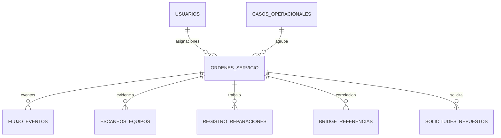

# 7. Base de datos y ERD

**Base:** PostgreSQL — esquema `pmp`  
**Actualización:** 09-10-2026

## Principios

- Activos maestros separados en validadores y consolas.
- Identidad lógica: tipo + serie.
- `pmp.usuarios` contiene rol/estado efectivo y vínculo Firebase.
- `pmp.ordenes_servicio` representa intervenciones.
- `pmp.flujo_eventos` conserva hechos del flujo.
- `pmp.escaneos_equipos` y evidencias de dominio respaldan identidad física.
- Casos y referencias externas son relaciones, no identidades sustitutas.
- Movimientos actuales no deben inferirse solo de una fecha o estado legacy.

## Entidades principales

| Entidad | Propósito |
|---|---|
| `usuarios` | identidad operacional, rol, activo, Firebase UID |
| `validadores` / `consolas` | maestros de activos |
| `ordenes_servicio` | OS PMP |
| `casos_operacionales` | necesidad/caso |
| `bridge_referencias` | correlación externa |
| `flujo_eventos` | historial de hechos |
| `escaneos_equipos` | evidencia de lecturas |
| `registro_reparaciones` | trabajo técnico |
| `repuestos`, `solicitudes_repuestos`, `solicitud_items` | stock y solicitudes |
| `estados`, `ubicaciones`, `os_transiciones` | catálogos/flujo |
| `buses`, `terminales`, `pst`, `terminal_pst` | contexto operacional |

## Relación simplificada

## Migraciones

Las migraciones aditivas se encuentran en `05_BaseDatos/migraciones/`. Los scripts de demo/reset no son instrucciones de producción.

Para el detalle exacto de columnas y restricciones, usar el DDL/migraciones vigentes; este documento es una vista arquitectónica.
