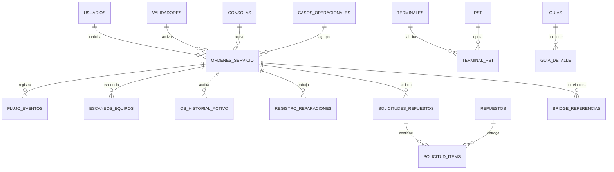

# Arquitectura 07 — Base de Datos / ERD V2.0

**Versión:** V2.0  
**Motor:** PostgreSQL · esquema `pmp`

## 1. Principio

El modelo separa:

- maestros;
- activos;
- caso/requerimiento;
- OS/intervención;
- evidencia física;
- eventos;
- reparación;
- stock/repuestos;
- QA;
- correlaciones externas.

La identidad de activo es lógica: `tipo_equipo + serie`.

## 2. Inventario

### Maestros/configuración

`estados`, `ubicaciones`, `usuarios`, `terminales`, `pst`, `terminal_pst`, `buses`, `config_estado_ubicacion`, `repuestos`.

### Operacionales

`validadores`, `consolas`, `casos_operacionales`, `ordenes_servicio`, `flujo_eventos`, `escaneos_equipos`, `os_historial_activo`, `registro_reparaciones`, `solicitudes_repuestos`, `solicitud_items`, `bridge_referencias`, `bridges`, `bridge_mantenimiento`, `instalaciones_equipos`, `qa_inspecciones`, `guias`, `guia_detalle`.

## 3. Relaciones principales

## 4. Integridad

- PK/FK y checks de tipo/serie.
- historial append-only;
- identidad OS inmutable;
- caso y relaciones críticas inmutables;
- referencias externas validadas contra OS/activo;
- evento de stock inicial consumible una vez;
- AMID único cuando existe;
- transacciones y locks en escrituras críticas.

## 5. Custodia

La ubicación real no se deduce solo desde `estado_id`; se construye con:

- ubicación;
- eventos de entrada/salida;
- último escaneo/evidencia;
- ciclo Lab/QA;
- estado;
- stock origen.

## 6. Diccionario completo

Tipos, campos, restricciones, secuencias, vistas, triggers y decisiones están documentados en:

[MODELO_DATOS_DICCIONARIO_V2.0.md](MODELO_DATOS_DICCIONARIO_V2.0.md)

La fuente física definitiva continúa siendo PostgreSQL + migraciones.
