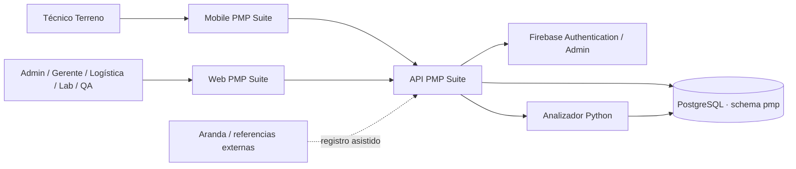

# Arquitectura Integral PMP Suite V2.0

**Versión:** V2.0  
**Actualización:** 09-10-2026

## 1. Visión general

PMP Suite utiliza una arquitectura cliente-servidor modular con tres canales principales:

- Web React/Vite para operación y supervisión;
- Mobile Expo/React Native para Terreno;
- API REST Node/Express como única capa de reglas de negocio.

La persistencia se centraliza en PostgreSQL. Firebase autentica identidades, pero PostgreSQL define cuenta activa y rol efectivo. La analítica Python se ejecuta bajo demanda y trabaja en modo lectura.

## 2. Diagrama C4 — Contexto



## 3. Diagrama C4 — Contenedores

| Contenedor | Tecnología | Responsabilidad |
|---|---|---|
| Web | React 18 + TypeScript + Vite | operación, supervisión, administración |
| Mobile | Expo SDK 57 + React Native | operación Terreno y cuenta personal |
| API | Node.js + Express | autenticación, autorización, reglas, transacciones |
| DB | PostgreSQL | maestros, OS, eventos, evidencia, stock, usuarios |
| Firebase | Firebase Auth/Admin | identidad, credenciales, recuperación |
| IA | Python + pandas + psycopg2 | heurística de reincidencia |
| Brand/Shared | assets + shared/assetIdentity.js | identidad visual y reglas compartidas |

## 4. Capas Backend

```text
HTTP Route
  ↓
firebaseAuth
  ↓
ensureUser / identidad PostgreSQL
  ↓
authorize(action) / guard específico
  ↓
Service de dominio
  ↓
Transacción PostgreSQL
  ↓
Eventos / evidencia / proyección
```

### 4.1 Routes

Montajes principales:

- `/api/auth`
- `/api/os`
- `/api/requerimientos`
- `/api/activos`
- `/api/users`
- `/api/admin/users`
- `/api/dashboard`
- `/api/lab`
- `/api/qa`
- `/api/bodega`
- `/api/admin`
- `/api/master`
- `/api/ai`
- `/api/bridge`
- `/api/equipment-scan`

El catálogo detallado se mantiene en `CATALOGO_API_V2.0.md`.

### 4.2 Services

Servicios de dominio vigentes:

- assetIdentity / assetManagement;
- initialAssetStock;
- requirements / requirementSearch;
- terrainWithdrawal;
- warehouseReceipt / warehouseDispatch / warehouseLabDispatch;
- logisticsInventory / logisticsPresentation;
- labArrival / labCustody / labReceptionRead / labSupervision / labWork;
- qaCustody / qaWork;
- warehouseParts;
- equipmentScan;
- assetHistory / technicalAssetHistory;
- bridgeFlow;
- executiveDashboard.

## 5. Seguridad y autorización

### 5.1 Fuente de identidad

Firebase valida el token. El backend resuelve `firebase_uid`/correo contra `pmp.usuarios`.

### 5.2 Fuente de autorización

El rol efectivo es PostgreSQL. No se aceptan roles enviados por body/query/claims como concesión de permisos.

### 5.3 Política por acción

La política efectiva se define en `src/security/authorization.js`. No existe un wildcard para Admin.

| Acción | Roles efectivos |
|---|---|
| `supervision.read` | admin, gerente |
| `lab.read` | admin, gerente, jefe_laboratorio, tecnico_laboratorio |
| `lab.supervise` | admin, gerente, jefe_laboratorio |
| `lab.custody` | jefe_laboratorio |
| `lab.assign` | jefe_laboratorio |
| `lab.work` | tecnico_laboratorio |
| `warehouse.read` | admin, gerente, logistica |
| `warehouse.move` | logistica |
| `warehouse.stock` | logistica |
| `assets.read` | admin, logistica |
| `assets.register` | logistica |
| `requirements.read` | admin, gerente, logistica, tecnico_laboratorio, qa |
| `requirements.catalog` | admin, logistica |
| `requirements.create` | logistica |
| `terrain.assign.read` | admin, logistica |
| `terrain.assign` | logistica |
| `terrain.work` | tecnico_terreno |
| `orders.read` | admin, gerente, tecnico_laboratorio, tecnico_terreno |
| `qa.read` | admin, gerente, qa |
| `qa.work` | qa |
| `scan.read` | admin, gerente, jefe_laboratorio, logistica, tecnico_laboratorio, qa |
| `scan.validate` | jefe_laboratorio, logistica, qa |
| `bridge.read` | admin, gerente, logistica, tecnico_laboratorio, qa |
| `bridge.link` | logistica |
| `users.manage` | admin |

**Excepción de proyección técnica:** el router de Bridge permite a `tecnico_terreno` y `jefe_laboratorio` consultar búsqueda/historial mediante un guard de roles y entrega una proyección técnica restringida; esto no les concede `bridge.read` completo ni `bridge.link`.

### 5.4 Scope por recurso

Además del rol, el backend verifica:

- técnico Lab = `tecnico_laboratorio_id`;
- técnico Terreno = `tecnico_terreno_id`;
- estación correcta;
- ciclo vigente;
- evidencia vigente;
- identidad tipo+serie;
- contexto de caso/destino;
- stock origen no consumido.

## 6. Arquitectura Web

### 6.1 Enrutamiento principal

- `/` Dashboard / redirect por rol
- `/admin/users`
- `/operacion/os`
- `/operacion/mis-os`
- `/operacion/ingreso`
- `/operacion/requerimientos`
- `/operacion/retiros`
- `/operacion/activos`
- `/operacion/escaneo`
- `/bridge`
- `/mi-carga/:osId`
- `/bodega/*`
- `/lab/*`
- `/qa/*`
- `/equipos-operativos`
- `/trazabilidad`
- `/ia/predicciones`
- `/settings`

### 6.2 Navegación por capacidades

La navegación se deriva desde `src/app/rbac.ts` y `src/app/navigation.ts`. Ocultar un menú no constituye seguridad; `ProtectedRoute` y Backend aplican el control real.

### 6.3 Principio de interacción

Proceso operacional = página/panel inline. Se evitan diálogos flotantes para secuencias de negocio. Los permisos de cámara/archivos siguen usando UI nativa.

## 7. Arquitectura Mobile

Pantallas vigentes:

- Login;
- Home / Mi jornada;
- Mis órdenes;
- Nueva falla;
- Retiro Terreno;
- Historial de activo;
- Configuración/Perfil/Seguridad/Apariencia.

Mobile consume la misma API y el mismo token Firebase. No replica reglas de autorización críticas.

## 8. Arquitectura de identidad física

`shared/assetIdentity.js` y el backend aplican una regla común.

```text
tipo + serie
   ↓
validación
   ↓
modelo / marca
```

No se permite que dos pantallas deriven atributos técnicos de manera diferente.

## 9. Arquitectura Physical First

Cada movimiento se divide en:

```text
1. resolver contexto
2. capturar identidad física
3. validar evidencia
4. revalidar estado/custodia
5. confirmar
6. escribir transición + evento
```

La evidencia incluye propósito, estación, usuario, activo y metadatos de contexto. Un cambio posterior invalida una evidencia antigua.

## 10. Arquitectura de estados y custodia

Los estados persistidos de OS se combinan con eventos/evidencia para construir el estado presentado.

Ejemplos derivados:

- PENDIENTE_RETIRO;
- EN_RUTA;
- ASIGNADO_TECNICO;
- En tránsito hacia Laboratorio;
- DISPONIBLE_INSTALACION;
- etapas QA.

Esto evita usar un único ID histórico para representar toda la semántica actual.

## 11. Arquitectura de eventos

`pmp.flujo_eventos` funciona como registro transversal append-only.

Eventos relevantes:

- ALTA_ACTIVO;
- VALIDACION_BODEGA;
- RECEPCION_INICIAL;
- HABILITADO_INSTALACION;
- REQUERIMIENTO_INGRESADO;
- RETIRO_TERRENO_CONFIRMADO;
- SALIDA_BODEGA_LABORATORIO;
- RECEPCION_LABORATORIO_CONFIRMADA;
- LAB_TRABAJO_INICIADO;
- LAB_AVANCE_GUARDADO;
- LAB_DIAGNOSTICO_CONFIRMADO;
- LAB_SOLICITUD_REPUESTO;
- LOGISTICA_ENTREGA_REPUESTO;
- LAB_REPARACION_FINALIZADA;
- LAB_LISTO_QA;
- SALIDA_LABORATORIO_BODEGA;
- SALIDA_BODEGA_QA;
- RECEPCION_QA_CONFIRMADA;
- QA_*;
- SALIDA_QA_BODEGA;
- SALIDA_BODEGA_TERRENO;
- INSTALACION_*.

## 12. Arquitectura de trazabilidad

La trazabilidad combina:

- OS actuales/históricas;
- `os_historial_activo`;
- `flujo_eventos`;
- `escaneos_equipos`;
- `registro_reparaciones`;
- `bridge_referencias`;
- casos;
- instalaciones.

La proyección para Terreno usa allowlist técnica y no expone información administrativa.

## 13. Arquitectura de stock

### 13.1 Stock inicial

Origen: evento `HABILITADO_INSTALACION`.

### 13.2 Stock reparado

Origen: OS reparada + QA operativo + recepción física Bodega.

### 13.3 Consumo

La creación de IN consume exactamente un origen:

- `stock_origen_evento` para activo inicial; o
- `stock_origen_os` para activo reparado.

Índices/validaciones impiden doble consumo.

## 14. Arquitectura de repuestos

Técnico Lab solicita **necesidad**. Bodega selecciona repuesto/cantidad, bloquea solicitud/inventario, valida stock y descuenta transaccionalmente.

El cierre técnico no descuenta inventario.

## 15. Arquitectura QA

QA mantiene snapshot del trabajo dentro de eventos versionados. El ciclo se identifica desde el envío Bodega→QA.

Etapas:

```text
RECEPCION
→ AMBIENTE
→ PRUEBAS
→ DICTAMEN
→ SALIDA
```

Dictamen y salida no son la misma transición.

## 16. Arquitectura de datos

El esquema `pmp` posee maestros, tablas operacionales, tablas de evidencia, eventos, referencias e inventario. El diccionario físico completo está en:

`MODELO_DATOS_DICCIONARIO_V2.0.md`.

## 17. Integraciones

### Firebase

Implementada: autenticación, administración de identidad, cambio/reset de contraseña.

### Aranda

No existe integración automática. La referencia se ingresa de forma asistida y queda correlacionada mediante caso/Bridge.

### Python

La API invoca el analizador y consume JSON. No escribe datos operacionales.

## 18. Despliegue

Entorno habitual:

- PostgreSQL local 5432;
- API 4000;
- Web 5173;
- Expo/Metro 8081;
- Firebase remoto;
- Python local.

Ubuntu/Nginx/PM2 es una proyección servidor; no se declara producción certificada.

## 19. Decisiones arquitectónicas relevantes

| Decisión | Justificación |
|---|---|
| PostgreSQL como autoridad de rol | evita confiar en claims obsoletos |
| eventos append-only | auditoría y reconstrucción histórica |
| Physical First | alinear registro y realidad física |
| Bridge solo correlación | evitar segundo motor operacional |
| separación Jefe Lab / Técnico | segregación de funciones |
| QA autónomo | eliminar asignación administrativa artificial |
| stock inicial sin OS | no inventar mantenimiento |
| IN en despacho | representa el movimiento real |
| proyecciones por rol | mínimo privilegio de información |

## 20. Diagramas asociados

- Contexto/C4.
- Componentes.
- Comunicación de servicios.
- ERD.
- Casos de uso.
- Secuencia.
- BPMN AS-IS.
- BPMN TO-BE.

Los BPMN vigentes están en `Documentacion Capstone/BPMN/`.


## 21. Trust boundaries y superficies de confianza

| Frontera | Confianza | Control |
|---|---|---|
| Navegador/Mobile → API | no confiable | token Firebase + validación de payload + RBAC |
| Firebase → API | identidad autenticada | verifyIdToken; claims no son rol efectivo |
| API → PostgreSQL | canal de servicio | queries parametrizadas + transacciones |
| API → Python | proceso local de lectura | salida JSON y sin escrituras operacionales |
| Operador físico → evidencia | requiere validación | estación, propósito, actor, ciclo y activo |
| UI → permisos | solo presentación | Backend vuelve a autorizar toda acción sensible |

La arquitectura asume que la UI puede ser manipulada; por eso las restricciones de negocio críticas están en Backend/BD.

## 22. Límites transaccionales

Las operaciones que combinan más de una escritura deben cerrarse atómicamente. Ejemplos:

- creación de caso + OS + correlación;
- confirmación de despacho + evento de salida;
- creación IN + consumo del origen de stock;
- entrega de repuesto + descuento de stock + actualización de solicitud;
- cambios administrativos protegidos sobre usuarios;
- confirmaciones de custodia con revalidación del ciclo vigente.

Los servicios utilizan `BEGIN/COMMIT/ROLLBACK`, `FOR UPDATE`, advisory locks o restricciones únicas según el dominio.

## 23. Idempotencia y concurrencia

La aplicación distingue:

1. **reintento idéntico:** puede responder como operación ya aplicada;
2. **reintento incompatible:** responde conflicto;
3. **evidencia stale:** no puede autorizar el ciclo actual;
4. **doble consumo:** bloqueado por origen de stock/índices;
5. **edición concurrente Lab/QA:** revisión/ciclo evita sobrescribir un avance posterior.

El objetivo no es solo evitar duplicados: es impedir que una respuesta tardía o una pestaña antigua modifique el estado físico actual.

## 24. Observabilidad, errores y degradación

- `/api/health` valida disponibilidad básica del servicio.
- Los errores de dominio usan 403/409/410/422 cuando corresponde.
- Un fallo de consulta no se transforma en cero o lista vacía.
- Los logs de autorización excluyen token, contraseña, correo y Firebase UID.
- Dashboards deben tener estados diferenciados de carga, vacío, error y acceso denegado.
- Las suites destructivas trabajan con PostgreSQL efímero para evitar contaminar la base habitual.

## 25. Secuencias arquitectónicas de referencia

### Retiro y recepción Bodega

```text
Mobile/Terreno
→ API valida OS propia
→ evidencia de retiro
→ confirmar retiro
→ evento/transito
→ Logística valida recepción
→ Logística confirma
→ evento/custodia Bodega
```

### Laboratorio

```text
Bodega valida salida
→ confirma salida
→ ciclo Lab
→ Jefe Lab valida recepción
→ confirma recepción
→ SLA
→ asignación
→ Técnico Lab trabajo/pruebas
→ cierre técnico
→ Jefe Lab valida/confirmar salida
```

### QA y reinstalación

```text
Bodega → QA
→ recepción QA
→ Ambiente
→ pruebas
→ dictamen
→ salida QA
→ recepción Bodega
→ elegibilidad
→ despacho Terreno + IN
→ instalación
```

## 26. Fuente de verdad por tipo de decisión

| Pregunta | Fuente primaria |
|---|---|
| ¿Quién puede hacer una acción? | `authorization.js` + guards de ruta |
| ¿Qué activo es? | `shared/assetIdentity.js` + maestros |
| ¿Dónde está físicamente? | eventos/evidencia/custodia proyectada |
| ¿Qué OS/caso corresponde? | `ordenes_servicio` + `casos_operacionales` |
| ¿Qué pasó técnicamente? | `registro_reparaciones` + eventos Lab/QA |
| ¿Está disponible? | origen de stock + custodia + ausencia de conflicto |
| ¿Qué ve cada rol? | API/proyección de dominio + RBAC Web/Mobile |
