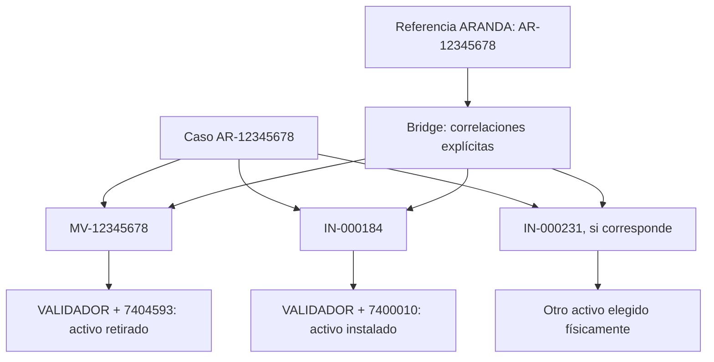

# Casos, ingreso de requerimientos y despacho por escaneo

Actualización: 22 de septiembre de 2026. Incluye IN independientes, Gestión de activos separada, recepción inicial sin OS e ingreso sobre parque existente.

Esta adenda define el contrato de la implementación y su guión de aceptación. Los resultados ejecutados, las migraciones y el guion actualizado están en el [informe vigente de recepción inicial](../08_Pruebas/RECEPCION_INICIAL_SIN_OS.md). La validación visual con lector y teléfono sigue pendiente.

La referencia funcional vigente de Bridge continúa siendo [Bridge: correlación externa e historial del activo](../08_Pruebas/BRIDGE_CORRELACION_Y_HISTORIAL.md). Esta adenda amplía el modelo operacional sin devolver operaciones a Bridge.

## 1. Diagnóstico previo a los cambios

La inspección del proyecto identificó los siguientes puntos:

- La arquitectura existente usa Express y PostgreSQL, React/TypeScript/Vite y Expo/React Native. Se mantiene esa distribución.
- `pmp.ordenes_servicio` concentra la intervención, tipo de activo, serie, responsables, ubicación, bus y estado. La auditoría de `002_bridge_correlacion.sql` ya impide cambiar el tipo o la serie de una OS existente.
- Bridge vigente inserta únicamente correlaciones. Sus antiguas acciones operacionales responden `410 BRIDGE_CORRELATION_ONLY`.
- El índice único de `pmp.bridge_referencias` comprende tipo, serie, OS, sistema externo y referencia. Ya permite una referencia externa vinculada a varias OS y varios activos; no es necesario relajar la protección contra vínculos exactamente duplicados.
- El historial consulta por tipo + serie y reúne órdenes, correlaciones, eventos, escaneos, reparación, QA e instalaciones históricas. La búsqueda existente resuelve identificadores hacia activos. Faltaba representar el caso y reconstruir sus intervenciones mediante relaciones explícitas.
- La disponibilidad y los estados logísticos ya se presentan mediante condiciones derivadas. Una asignación, por sí sola, no demuestra salida física. `SALIDA_BODEGA_TERRENO` constituye la evidencia del despacho.
- El stock estaba ligado a una OS preparada para instalar y el formulario partía de una fila concreta. La recepción desde QA podía generar anticipadamente una instalación. Este acoplamiento se sustituye, para el nuevo flujo, por stock del activo reparado y creación de IN únicamente al confirmar el despacho.
- Las pruebas HTTP existentes utilizan un clúster PostgreSQL efímero con esquema copiado sin datos, fixtures propias y eliminación del clúster. Los datos operacionales de la base original no son fixtures.
- `07_Mobile/package.json` mantiene Expo SDK 57. La exportación Android/iOS comprueba los bundles; no equivale a una instalación firmada o a una prueba en teléfono físico.
- Documentación antigua todavía atribuía asignaciones, instalaciones y creación de mantenimiento a Bridge. Se conserva como evidencia histórica, con avisos y enlaces al contrato vigente.

## 2. Cuatro conceptos y relaciones

| Concepto | Identidad | Función |
|---|---|---|
| Caso/requerimiento | Identificador propio y origen | Agrupa la necesidad operacional, el activo que falló y sus intervenciones relacionadas. |
| OS PMP | `codigo_os` | Representa una intervención concreta de un activo determinado. |
| Activo físico | Tipo + serie | Identidad inmutable del historial individual. |
| Referencia externa | Sistema + referencia textual | Identificador ajeno a PMP, conservado mediante Bridge. |

Una referencia externa no sustituye una OS. Una OS de reparación no se reutiliza para instalar el reemplazo. Las relaciones entre caso, OS origen e instalaciones se guardan en datos; compartir números en el código no crea una relación.



Los eventos de `7404593` permanecen en su historial. Los de `7400010` permanecen en el suyo. La vista de caso permite navegar entre ambos, manteniendo visible la identidad de cada activo.

## 3. Esquema de códigos

| Intervención | Prefijo | Ejemplo externo |
|---|---|---|
| Mantención de validador | `MV` | `MV-00123456` |
| Mantención de consola | `MC` | `MC-22334455` |
| PoD de validador | `PDV` | `PDV-33445566` |
| PoD de consola | `PDC` | `PDC-44556677` |
| Instalación | `IN` + correlativo propio PMP | `IN-000184` |
| Referencia Aranda | `AR` | `AR-00123456` |

Se acepta `00123456` o `AR-00123456`; ambos se normalizan a `AR-00123456`. El componente `00123456` permanece como **texto** de extremo a extremo. Nunca se convierte a entero.

Los casos internos usan identificadores como `INT-000001`. Todas las instalaciones, internas o relacionadas con Aranda, usan la misma secuencia independiente `pmp.seq_in`: por ejemplo `IN-000184`, `IN-000231`. El caso se relaciona mediante `caso_id` y `os_origen`; no determina la identidad de la IN. Mantenimiento/PoD interno conserva sus correlativos existentes.

Cada instalación consume su propio correlativo al confirmar el despacho. PostgreSQL garantiza la concurrencia mediante `nextval`; los números consumidos por operaciones revertidas no se reutilizan, por lo que puede haber saltos. Las instalaciones previas nunca se renumeran. Los códigos de los ejemplos son ilustrativos: verificar los correlativos reales generados.

Los códigos históricos `MV-000173`, `MC-000174` y las IN ya existentes conservan su código y relaciones. No se renumeran para adoptar esta convención. Si un código nuevo colisiona con uno histórico, se informa el conflicto; no se sobrescribe el histórico.

PoD conocido desde el ingreso utiliza directamente PDV/PDC. Cuando un mantenimiento deriva posteriormente a PoD, se conserva MV/MC y se relaciona el proceso correspondiente con el mismo caso y activo cuando realmente deba coexistir. No se renombra la OS original ni se duplica un proceso ya existente.

## 4. Ingreso Aranda o interno

**Ingreso de requerimientos** es el punto de entrada operacional para administración y logística, según sus permisos. Registra origen, referencia externa cuando existe, tipo, serie, bus/PPU, terminal/ubicación, falla, observación, fecha y clasificación.

La confirmación valida el activo y crea el requerimiento y la OS adecuada. Para origen Aranda conserva la referencia y registra la correlación dentro de la misma transacción cuando corresponde. La generación de la OS pertenece a este servicio operacional: Bridge conserva únicamente el vínculo de la OS ya creada.

Ingreso de requerimientos **no crea ni modifica activos**. Tipo y bus sugieren equipos en operación según la relación registrada; el buscador permite filtrar por serie, hasta 30 coincidencias. El usuario selecciona explícitamente el activo y la API revalida tipo + serie y su vínculo vigente con el bus. Una serie desconocida muestra **Activo no registrado en PMP Suite** y explica que debe registrarse previamente en **Gestión de activos**; no permite crear caso, OS o Bridge.

**Gestión de activos**, exclusiva de Admin/Logística, registra tipo, serie, modelo/marca conocidos, origen, fecha y observación. Los atributos técnicos desconocidos siguen en NULL. Registrar crea el maestro y su auditoría `ALTA_ACTIVO`: no asigna Bodega, QA, instalación, técnico ni stock. **Recepcionar activo nuevo** exige lectura física válida en BODEGA y confirmación explícita de identidad, integridad y conformidad inicial. Registra `ESCANEO_BODEGA`, `RECEPCION_INICIAL` y `HABILITADO_INSTALACION` en los modelos existentes, sin ninguna OS ni bus ficticio. El activo queda disponible sin pasar por diagnóstico/reparación ni inventar una aprobación QA. Su primera OS se crea al confirmar el despacho: una IN independiente. La estación conserva sus permisos vigentes.

En una puesta en producción, PMP Suite recibe inicialmente el maestro de activos instalados y de stock. A partir de esa fotografía inicial, los requerimientos operacionales siempre referencian activos existentes. La carga inicial también debe incorporar relaciones verificadas con los buses; crear únicamente las filas del maestro no establece una instalación. El diseño y los límites de la futura importación CSV/Excel están en el [informe vigente](../08_Pruebas/MODELO_DEFINITIVO_ACTIVOS.md#5-carga-inicial-del-parque).

```text
Aranda o necesidad interna
  → Ingreso de requerimientos
  → validación de tipo + serie
  → caso y OS PMP
  → correlación Bridge, si existe referencia externa
  → circuito operacional de la OS
```

Repetir el mismo requerimiento, activo y proceso no crea otra OS accidentalmente. El conflicto identifica la operación existente. PMP admite casos internos sin Aranda y no necesita credenciales ni conectividad hacia esa plataforma.

## 5. Reparación e identidad del activo

```text
AR-12345678 → MV-12345678 → VALIDADOR + 7404593
  → retiro → recepción → laboratorio → diagnóstico/reparación
  → QA → recepción en bodega
```

La OS conserva siempre `7404593`. La recepción conforme desde QA puede cerrar la intervención de reparación en estado existente 13 y dejar el activo aprobado en Bodega. Esa recepción **no crea una nueva IN**. El activo queda elegible en el pool cuando satisface las reglas de disponibilidad, sin asignación, despacho ni instalación activos incompatibles.

## 6. Bodega: contexto, lectura física y confirmación

**Inventario de equipos → Listos para instalación** es el pool consultable de activos elegibles. La acción principal de despacho comienza por el contexto; no obliga a preseleccionar una serie en una fila.

1. Registrar o seleccionar caso, OS origen cuando corresponda, tipo requerido, bus destino, terminal y técnico.
2. Tomar físicamente un equipo del stock y leer su serie/AMID mediante el mecanismo de captura existente.
3. Resolver el activo y validar tipo, serie, ubicación Bodega, disponibilidad, conformidad inicial o QA de reparación y ausencia de asignación, instalación o intervención incompatible.
4. Mostrar el activo detectado, modelo cuando exista, estado, ubicación y validación de ingreso. Un rechazo explica la causa y permite leer otro equipo.
5. Habilitar la confirmación únicamente para una lectura válida en su contexto.
6. Al confirmar, volver a validar dentro de una transacción: crear IN, relacionarla con caso/origen y activo, asignar técnico, guardar bus/terminal, registrar evidencia de escaneo y `SALIDA_BODEGA_TERRENO`, retirar disponibilidad y agregar correlación externa si existe.

Abrir el formulario, elegir técnico/PPU, consultar stock o escanear no crea una IN ni un despacho. El escaneo conserva su evidencia vinculada a la intervención del activo que sustentaba el stock o directamente al activo nuevo. La IN guarda `stock_origen_os` para stock reparado o `stock_origen_evento` para recepción inicial, sin alterar el registro original. La lectura de recepción no sustituye la lectura contextual de despacho.

Si la disponibilidad cambia entre lectura y confirmación, la confirmación rechaza el despacho de forma controlada. No quedan una IN huérfana, un vínculo sin OS ni una asignación parcial. La UI informa los errores inline, conserva el contexto y no abre otro modal detrás del formulario.

La captura manual no se presenta silenciosamente como una lectura de pistola. Se mantiene la validación productiva de evidencia física y la distinción de origen cuando el modelo la expone.

## 7. Instalación y móvil

La IN aparece en **Mis Órdenes** del técnico asignado con código, tipo/serie, bus, terminal, motivo, caso, OS origen, referencia y fecha disponibles. Mobile ejecuta la instalación del activo asignado; no elige otro reemplazo desde stock.

La instalación usa la FSM existente para completar la IN y registrar el equipo en el bus. Se conservan técnico, fecha, serie, bus, eventos y relaciones. La reparación del activo retirado continúa de manera independiente.

| Representación | Significado |
|---|---|
| Disponible para instalación | Elegible, aprobado conforme al flujo y físicamente en Bodega. |
| Asignado a técnico | Existe asignación; no acredita salida física. |
| En ruta | Existe despacho confirmado `SALIDA_BODEGA_TERRENO` y aún no se ha completado su instalación/retorno. |
| En operación | Equipo instalado en bus y operativo. |
| Diagnóstico, reparación o QA | Circuito de laboratorio/calidad correspondiente. |

Los KPI distinguen órdenes de activos. Una nueva IN aumenta las órdenes activas cuando corresponde; no crea otro activo físico. El despacho cambia el contador En ruta y la instalación lo reduce. **Equipos en operación** conserva su nombre y no se ofrece como stock asignable.

## 8. Bridge, historial y búsqueda

El historial del activo también incluye ALTA_ACTIVO, ESCANEO_BODEGA, RECEPCION_INICIAL y HABILITADO_INSTALACION aunque todavía no exista ninguna OS. Tipo + serie permite consultar esos eventos y, posteriormente, las intervenciones reales de la misma identidad.

Bridge mantiene `REFERENCIA EXTERNA ↔ OS PMP`, verificando tipo + serie. No asigna, reserva, despacha, instala, cambia estados, crea reparación ni cierra órdenes.

El índice único existente de `bridge_referencias` protege el vínculo completo. Son válidos `AR-12345678 ↔ MV-12345678` y `AR-12345678 ↔ IN-000184` sobre sus activos respectivos. Repetir exactamente cualquiera de los vínculos es un duplicado.

La búsqueda por serie prioriza el historial individual. MV/MC/PDV/PDC/IN conducen al activo de esa OS y permiten navegar a su caso relacionado. AR o identificador de caso permiten reconstruir el caso completo, con sus distintas OS y activos. Las relaciones se consultan en datos; no se infieren analizando los códigos.

## 9. Migración y compatibilidad

La evolución incorpora relaciones de caso de forma aditiva, reutilizando órdenes, Bridge, catálogos, escaneos y eventos. Debe ser idempotente cuando sea técnicamente posible y verificarse antes/después. No se elimina ni renombra una OS histórica y no se modifica la identidad de activos existentes.

La migración `003_casos_operacionales.sql` agregó casos y relaciones. `004_os_independientes_alta_activos.sql` mantiene IN independientes y modelos desconocidos. `005_gestion_activos.sql` añade procedencia, fecha, observación y autor de alta en ambos maestros. `006_recepcion_inicial_sin_os.sql` permite eventos y escaneos iniciales por activo sin OS y relaciona la primera IN con el evento que habilitó su stock. No modifica filas previas ni renumera OS. El [informe](../08_Pruebas/RECEPCION_INICIAL_SIN_OS.md) registra aplicación y conservación histórica. Aplicar las migraciones en orden; el alta desde Requerimientos está retirada de la API.

Se mantienen los permisos de los circuitos existentes. Logística/admin registran requerimientos y despachan según su autorización; terreno ejecuta sus OS; laboratorio/QA conservan su carga; gerente consulta. No se agregan estados si basta con representaciones derivadas.

## 10. Alcance Capstone e integración productiva futura

PMP Suite constituye una solución autónoma. Dentro del alcance del Capstone, los requerimientos originados en plataformas externas se registran mediante ingreso asistido. El sistema genera órdenes internas independientes y conserva la referencia externa mediante una capa de correlación. La arquitectura permite sustituir posteriormente el ingreso manual por una integración automatizada con sistemas corporativos sin modificar el modelo central de trazabilidad.

La integración automática mediante API, Web Service, webhook o ETL queda **fuera del alcance del Capstone**. Se documenta como **proyección de integración productiva/comercial** ante una eventual implementación en SONDA:

```text
ARANDA
  → API / integración futura
  → Ingreso de requerimientos PMP
  → creación automática de OS
  → correlación Bridge automática
  → flujo operacional existente
```

La diferencia está en cómo ingresa el requerimiento. El caso, las OS, la identidad física, Bridge y las reglas operacionales siguen siendo los mismos. La solución conserva Expo SDK 57. Esta evolución no incorpora Docker, Dockerfile, docker-compose ni diagramas de contenedores.

## 11. Verificaciones y evidencia a registrar

Los resultados actualizados, comandos y evidencias están en el [informe de recepción inicial](../08_Pruebas/RECEPCION_INICIAL_SIN_OS.md). La tabla conserva los comandos reproducibles; los registros de entregas anteriores permanecen en sus informes históricos.

| Verificación | Comando/criterio | Resultado |
|---|---|---|
| Backend | `npm test` en `03_Backend/pmp-api` | Consultar evidencia actual. |
| Frontend | `npm test` en `04_Frontend` | Consultar evidencia actual. |
| Build web | `npm run build` en `04_Frontend` | Correcto. |
| Mobile SDK 57 | `node node_modules/expo/bin/cli export --platform android --platform ios --output-dir ../tmp/requirements-mobile` en `07_Mobile` | Código 0; ambos bundles verificados. |
| Bridge | `node verification/bridge_correlation_e2e.mjs` | Aprobado. |
| Escaneo | `node verification/equipment_scan_flow_e2e.mjs` | Aprobado. |
| Logística | `node verification/logistics_nomenclature_e2e.mjs` | Aprobado. |
| Nuevos E2E | `node verification/requirements_flow_e2e.mjs`: ingreso, prefijos, múltiples IN, caso, identidad, Bridge, rollback/concurrencia | Aprobado. |
| Migración | Repetición segura y comparación de datos históricos antes/después | Idempotente; datos conservados, incluidas 100 OS históricas. |
| Aislamiento | Bases efímeras eliminadas y base original sin cambios por pruebas | Comprobado en evidencias E2E. |
| Recorrido visual y teléfono | Guión siguiente | Pendiente hasta ejecución humana documentada. |

Las exportaciones Expo generan bundles; no APK/IPA firmados. No se presentan como evidencia de pruebas en teléfono físico. Los resultados anteriores del proyecto conservan su fecha y no se reutilizan como resultados de esta evolución.

## 12. Guión manual E2E detallado

Usar una base de demostración aislada con usuarios de logística, terreno, laboratorio, QA y admin; catálogos de bus/terminal; el validador `7404593` que presenta falla y `7400010` aprobado en Bodega. Si estas series no están disponibles, usar equivalentes y registrar la sustitución en la evidencia. Preparar una consola y un segundo validador elegible para escenarios adicionales. No alterar datos productivos para fabricar estados.

1. Anotar el total de activos, OS, stock y En ruta. Guardar una OS histórica de cada prefijo disponible y su tipo/serie para comparar al final.
2. Como logística abrir **Ingreso de requerimientos**. Registrar origen ARANDA, referencia `12345678`, VALIDADOR, bus `BJ2514`, terminal `Ciprés`, operador, falla QR y fecha. Seleccionar explícitamente `7404593` entre las sugerencias del bus o mediante búsqueda por serie; debe existir en el parque instalado. Confirmar una vez.
3. Comprobar caso `AR-12345678`, OS `MV-12345678` y correlación explícita entre ambos. La OS debe pertenecer a `7404593`. Comprobar que otro activo en stock no cambió por registrar el requerimiento.
4. Repetir exactamente el ingreso. Debe mostrarse un conflicto controlado y no aumentar el número de OS del mismo proceso.
5. Con otro activo elegible registrar `AR-00123456`. Verificar referencia `AR-00123456` y OS `MV-00123456`, conservando todos los ceros en listas, búsqueda e historial.
6. Registrar mantenimiento de consola `AR-22334455`, PoD de validador `AR-33445566` y PoD de consola con una referencia diferente. Comprobar MC, PDV y PDC y sus identidades respectivas.
7. Registrar un requerimiento INTERNO sin referencia. Comprobar caso interno y OS interna válidos; la ausencia de Aranda no bloquea la operación.
8. Ejecutar el retiro/recepción de `7404593` y su circuito de laboratorio, reparación, QA y recepción en Bodega con las estaciones, roles y escaneos existentes. La OS original sigue siendo MV y conserva la misma serie en todo momento.
9. Al recibir el activo aprobado desde QA comprobar que queda en el pool y que la recepción no crea una IN anticipada. Una reparación cerrada aprobada en Bodega puede sustentar el stock del activo.
10. Abrir **Inventario de equipos → Listos para instalación** y la acción principal **Despacho por escaneo** (o su etiqueta UI equivalente), sin seleccionar ninguna fila. Elegir el caso AR-12345678, MV origen, bus, terminal, tipo VALIDADOR y técnico Rodrigo Escobar.
11. Antes de leer un equipo comprobar que elegir técnico/PPU no creó IN ni `SALIDA_BODEGA_TERRENO` ni incrementó En ruta.
12. Escanear una CONSOLA. Verificar mensaje con tipo detectado/requerido y confirmación bloqueada. El contexto del formulario debe conservarse.
13. Repetir con fixtures de QA pendiente, QA rechazado, fuera de Bodega, instalado, asignado, En ruta, serie desconocida e intervención incompatible. Cada lectura debe explicar el rechazo y no crear IN, despacho ni cambios de stock.
14. Tomar físicamente `7400010` elegible y leer la serie o su AMID válido. Revisar tipo, serie, modelo, Bodega, disponibilidad y QA. La confirmación queda habilitada; todavía no existe IN ni despacho por la lectura sola.
15. Cancelar una vez y volver a iniciar el flujo. Confirmar que no quedaron órdenes fantasma. Leer de nuevo el equipo y confirmar asignación y despacho explícitamente.
16. Comprobar `IN-000184`, serie `7400010`, caso/OS origen, técnico, bus, terminal, vínculo `AR-12345678 ↔ IN-000184`, escaneo relacionado y un solo `SALIDA_BODEGA_TERRENO`. Stock disminuye y En ruta aumenta una unidad.
17. En una sesión concurrente o en el harness aislado, repetir confirmación del mismo equipo. Debe rechazarse sin duplicar IN/eventos y sin dejar asignación parcial. Provocar un rechazo de validación tras la lectura y comprobar error visible inline, contexto preservado y rollback de toda la operación.
18. Iniciar sesión de Rodrigo en Mobile SDK 57. En **Mis Órdenes** revisar IN-000184 con serie, bus, tipo, terminal, caso/origen, motivo y fecha. No debe ofrecer elegir otra serie desde stock.
19. Completar la instalación conforme al flujo existente. Verificar IN completada, bus BJ2514 asociado a `7400010`, En ruta reducido y equipo **En operación**. La reparación MV de `7404593` no cambia como efecto colateral.
20. Crear una necesidad adicional del mismo caso y despachar otro activo elegible. Verificar `IN-000231`; `IN-000184` conserva su nombre e identidad.
21. Despachar para el caso interno. Verificar formato `IN-000232` o el siguiente correlativo PMP disponible, relación explícita y ausencia de correlación Aranda inventada.
22. Buscar `7404593`, MV-12345678, `7400010` e IN-000184. Cada serie muestra exclusivamente sus propias OS/eventos. Los enlaces al caso permiten navegar a otras intervenciones sin fusionar los historiales.
23. Buscar `AR-12345678`. Revisar caso completo: falla, bus, terminal, activo retirado, MV, activos de reemplazo, IN-000184/IN-000231, técnicos, fechas, resultados y referencias. Si ambos maestros comparten una serie, el tipo debe diferenciarlos.
24. Abrir Bridge. Correlacionar una referencia adicional a una OS existente. Comparar antes/después: únicamente aumenta el vínculo, sin asignación, estado, stock, eventos de despacho ni OS nueva. Repetir el vínculo exacto y comprobar rechazo de duplicado.
25. Comprobar que acciones Bridge operacionales retiradas siguen respondiendo 410 y campos operativos enviados al formulario/API de correlación se rechazan. Verificar permisos de gerente, terreno, Lab/QA conforme a sus rutas actuales.
26. En la base aislada intentar mutar tipo o serie de una OS existente. Debe rechazarse. Comparar todas las OS históricas anotadas: mismos códigos, activos y datos previos.
27. Revisar dashboard: activos distintos de órdenes; nueva IN cuenta como orden activa cuando corresponde; seleccionar técnico y escanear sin confirmar no suman En ruta; completar instalación resta En ruta. Equipos en operación nunca aparece como stock asignable.
28. Guardar capturas, fecha, usuarios de prueba, respuestas, conteos y resultado obtenido de cada paso. Eliminar el entorno efímero de pruebas y verificar base original intacta.

## 13. Contenido del informe de cierre

El informe de implementación debe completar estos veinte puntos con lo efectivamente realizado:

1. Resumen funcional.
2. Decisiones de arquitectura y compatibilidad.
3. Esquema definitivo de códigos OS.
4. Flujo de ingreso Aranda.
5. Flujo de reparación.
6. Flujo de Bodega con selección mediante lectura física.
7. Flujo de instalación IN.
8. Funcionamiento definitivo de Bridge.
9. Cambios backend.
10. Cambios frontend.
11. Cambios Mobile y SDK conservado.
12. Migraciones preparadas/aplicadas y verificación antes/después.
13. Archivos modificados por esta entrega.
14. Pruebas/builds/E2E ejecutados y resultados, con evidencias.
15. Riesgos o limitaciones pendientes, incluida prueba visual/dispositivo si falta.
16. Guión manual y pasos realmente ejecutados.
17. Actualización documental Capstone y documentos históricos rotulados.
18. Confirmación de que no se agregó Docker.
19. Confirmación de que no se alteraron códigos ni identidades de OS históricas.
20. Confirmación de que Bridge continúa sin lógica operacional.
