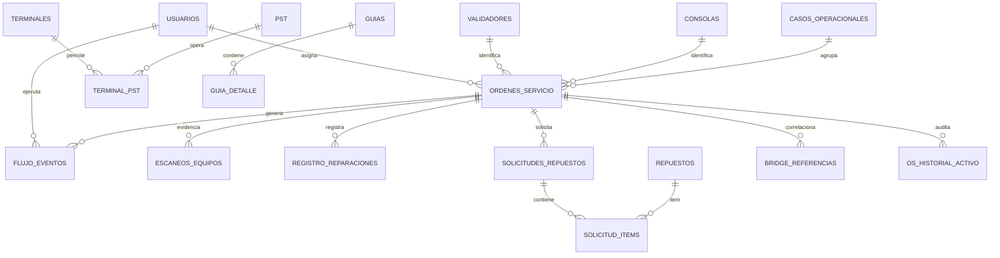

# Modelo de Datos y Diccionario — PMP Suite V2.0

**Versión:** V2.0  
**Motor:** PostgreSQL  
**Esquema:** `pmp`  
**Actualización:** 09-10-2026

## 1. Objetivo

Documentar el modelo físico vigente de PMP Suite, incluyendo tablas base, extensiones agregadas por migraciones, relaciones, restricciones, secuencias, vistas, triggers y decisiones de integridad.

La fuente de esta documentación es la combinación de:

1. estructura base respaldada del esquema PMP;
2. migraciones versionadas;
3. servicios Backend vigentes;
4. verificaciones de estructura usadas por las suites E2E.

## 2. Inventario de tablas vigente

La herramienta de verificación clasifica las tablas del esquema en:

### Configuración / maestros

- `estados`
- `ubicaciones`
- `usuarios`
- `terminales`
- `pst`
- `terminal_pst`
- `buses`
- `config_estado_ubicacion`
- `repuestos`

### Operacionales / históricas

- `bridge_mantenimiento`
- `bridge_referencias`
- `bridges`
- `casos_operacionales`
- `consolas`
- `escaneos_equipos`
- `flujo_eventos`
- `guia_detalle`
- `guias`
- `instalaciones_equipos`
- `ordenes_servicio`
- `os_historial_activo`
- `qa_inspecciones`
- `registro_reparaciones`
- `solicitud_items`
- `solicitudes_repuestos`
- `validadores`

Total clasificado: **26 tablas**.

## 3. Enumeraciones base

### `categoria_equipo`

- VALIDADOR
- CONSOLA
- GENERICO

### `estado_guia`

- EMITIDA
- RECIBIDA

### `estado_solicitud`

- PENDIENTE
- APROBADA
- RECHAZADA
- DESPACHADA

### `motivo_stock`

- CONSUMO_OS
- AJUSTE
- RECEPCION_GUIA
- AJUSTE_AUTO
- UPDATE_MANUAL

### `tipo_equipo_os`

- VALIDADOR
- CONSOLA

### `tipo_evento_os`

- CAMBIO_ESTADO
- COMENTARIO
- ALERTA_IA

### `tipo_ubicacion_enum`

- BODEGA
- LABORATORIO
- QA

# 4. Maestros

## 4.1 `usuarios`

| Campo | Tipo | Regla |
|---|---|---|
| id | uuid | PK, default gen_random_uuid() |
| nombre | varchar(100) | NOT NULL |
| apellido | varchar(100) | NOT NULL |
| correo | varchar(150) | NOT NULL, UNIQUE |
| rol | varchar(50) | NOT NULL |
| activo | boolean | default true |
| firebase_uid | varchar(128) | vínculo Firebase |

El rol efectivo se obtiene de esta tabla. El backend reconoce siete valores oficiales.

## 4.2 `validadores`

| Campo | Tipo | Regla |
|---|---|---|
| serie | varchar(50) | PK |
| modelo | varchar(50) | actualmente admite NULL para históricos |
| marca | varchar(50) | default Mikroelektronika |
| amid | varchar(32) | único cuando existe; formato 12 dígitos |
| origen_registro | varchar(80) | metadata de alta |
| fecha_ingreso | timestamptz | metadata de alta |
| observacion_registro | text | metadata de alta |
| registrado_por | uuid | FK usuarios |

Regla de identidad V2.0: 72→CVB35; 74/75→CVB45.

## 4.3 `consolas`

| Campo | Tipo | Regla |
|---|---|---|
| serie | varchar(50) | PK |
| modelo | varchar(50) | admite NULL en históricos |
| marca | varchar(50) | default Waysion |
| origen_registro | varchar(80) | metadata de alta |
| fecha_ingreso | timestamptz | metadata de alta |
| observacion_registro | text | metadata de alta |
| registrado_por | uuid | FK usuarios |

Regla V2.0: modelo N9715 / Waysion.

## 4.4 `buses`

| Campo | Tipo |
|---|---|
| ppu | varchar(10), PK |

## 4.5 `terminales`

| Campo | Tipo | Regla |
|---|---|---|
| id | integer | PK |
| nombre | varchar(100) | NOT NULL, UNIQUE |

## 4.6 `pst`

| Campo | Tipo |
|---|---|
| codigo | varchar(20), PK |
| nombre | varchar(120), NOT NULL |

## 4.7 `terminal_pst`

| Campo | Tipo | Relación |
|---|---|---|
| terminal_id | integer | PK compuesta, FK terminales |
| pst_codigo | varchar(20) | PK compuesta, FK pst |

La relación se revalida en Backend antes de crear requerimientos/OS.

## 4.8 `estados`

| Campo | Tipo |
|---|---|
| id | integer, PK |
| nombre | varchar(50), UNIQUE |

Los IDs históricos continúan utilizándose; la presentación actual puede derivar estados más específicos mediante eventos.

## 4.9 `ubicaciones`

| Campo | Tipo |
|---|---|
| id | integer, PK |
| nombre | varchar(100) |
| tipo | tipo_ubicacion_enum |

## 4.10 `config_estado_ubicacion`

PK compuesta `estado_id + tipo_ubicacion`. Define combinaciones de estado/ubicación permitidas para lógica histórica de validación.

## 4.11 `repuestos`

| Campo | Tipo | Regla |
|---|---|---|
| id | integer | PK |
| nombre | varchar(150) | NOT NULL |
| categoria | categoria_equipo | NOT NULL |
| stock | integer | >=0 |
| stock_critico | integer | default 5 |

# 5. Núcleo operacional

## 5.1 `ordenes_servicio`

Tabla central de intervenciones.

### Campos base

| Campo | Tipo | Uso |
|---|---|---|
| codigo_os | varchar(50) | PK |
| fecha | timestamp | creación |
| tipo_equipo | varchar(20) | VALIDADOR/CONSOLA |
| es_pod | boolean | clasificación PoD |
| validador_serie | varchar(50) | FK validadores |
| consola_serie | varchar(50) | FK consolas |
| falla | text | falla reportada |
| estado_id | integer | FK estados |
| bus_ppu | varchar(10) | FK buses |
| terminal_id | integer | FK terminales |
| pst_codigo | varchar(20) | FK pst |
| ubicacion_id | integer | FK ubicaciones |
| tecnico_terreno_id | uuid | FK usuarios |
| tecnico_laboratorio_id | uuid | FK usuarios |
| actualizado_en | timestamp | última actualización |

### Campos vigentes agregados/evidenciados por el código actual

| Campo | Uso |
|---|---|
| es_instalacion | distingue OS IN |
| es_aprobado_qa | evidencia de resultado QA compatible con stock |
| ticket_aranda | compatibilidad histórica de referencia |
| qa_usuario_id | compatibilidad / contexto QA |
| qa_asignado_por | compatibilidad histórica |
| qa_asignado_en | compatibilidad histórica |
| caso_id | FK casos_operacionales |
| os_origen | FK ordenes_servicio |
| stock_origen_os | OS reparada consumida por una IN |
| instalacion_numero | columna legacy conservada |
| stock_origen_evento | FK flujo_eventos para stock inicial |

### Restricciones relevantes

- exactamente una serie según tipo;
- identidad tipo/serie inmutable;
- código generado en BD/backend;
- caso/origen/stock origen inmutables;
- `stock_origen_evento` solo para instalación;
- un evento de stock inicial se consume una sola vez.

## 5.2 `casos_operacionales`

| Campo | Tipo | Uso |
|---|---|---|
| id | bigserial | PK |
| codigo_caso | varchar(64) | UNIQUE |
| origen | varchar(32) | ARANDA / INTERNO |
| referencia_externa | varchar(120) | AR-… cuando aplica |
| componente | varchar(32) | componente de correlación |
| tipo_equipo | varchar(20) | tipo origen |
| serie_origen | varchar(50) | activo que originó el caso |
| bus_ppu | varchar(20) | bus |
| terminal_id | integer | terminal |
| pst_codigo | varchar(30) | operador |
| falla_reportada | text | falla |
| observacion | text | contexto |
| fecha_requerimiento | timestamptz | fecha negocio |
| creado_por | uuid | FK usuarios |
| creado_en | timestamptz | auditoría |
| siguiente_instalacion | integer | compatibilidad de secuencia histórica |

La identidad del caso es inmutable salvo contador legacy.

## 5.3 `flujo_eventos`

Historial transversal append-only.

| Campo | Tipo |
|---|---|
| id | bigserial PK |
| bridge_codigo | varchar(32), nullable |
| codigo_os | varchar(50), nullable |
| tipo | varchar(64) |
| usuario_id | uuid |
| rol | varchar(50) |
| fecha | timestamptz |
| comentario | text |
| metadata | jsonb |
| tipo_equipo | varchar(20), nullable |
| serie | varchar(50), nullable |

Permite eventos asociados directamente a activo aun sin OS, por ejemplo recepción inicial.

Índices:

- por Bridge/fecha/id;
- por OS/fecha/id;
- por tipo_equipo/serie/fecha;
- único parcial para HABILITADO_INSTALACION inicial.

Trigger: validación de que el activo exista y bloqueo append-only.

## 5.4 `escaneos_equipos`

| Campo | Tipo | Regla |
|---|---|---|
| id | bigserial | PK |
| codigo_leido | varchar(64) | lectura |
| tipo_codigo | varchar(16) | SERIE/AMID |
| estacion | varchar(20) | BODEGA/LABORATORIO/QA |
| tipo_equipo | varchar(20) | resuelto |
| serie | varchar(50) | resuelta |
| amid | varchar(32) | opcional |
| codigo_os | varchar(50) | FK OS, nullable para recepción inicial |
| ubicacion_id | integer | FK ubicaciones |
| usuario_id | uuid | actor |
| rol | varchar(50) | rol al capturar |
| resultado | varchar(16) | VALIDADO/RECHAZADO |
| motivo | varchar(64) | requerido si rechazo |
| fecha | timestamptz | auditoría |
| metadata | jsonb | propósito/ciclo/contexto |

La tabla es append-only.

## 5.5 `os_historial_activo`

| Campo | Tipo |
|---|---|
| id | bigserial PK |
| codigo_os | varchar(50) |
| tipo_equipo | varchar(20) |
| serie | varchar(50) |
| fecha | timestamptz |
| evento | varchar(32) |
| anterior | jsonb |
| actual | jsonb |

Trigger sobre `ordenes_servicio` registra INSERT/UPDATE e impide cambio de identidad.

# 6. Laboratorio

## 6.1 `registro_reparaciones`

| Campo | Tipo |
|---|---|
| id | uuid PK |
| codigo_os | varchar(50), FK OS |
| tecnico_id | uuid, FK usuarios |
| falla_detectada | text |
| accion_realizada | text |
| repuestos_usados | text legacy |
| comentario | text |
| fecha_registro | timestamp |
| prueba_realizada | text |
| resultado_prueba | text |

En V2.0 `repuestos_usados` no gobierna stock; el inventario se gestiona en Bodega.

## 6.2 `solicitudes_repuestos`

Campos base:

- id PK;
- codigo_os FK;
- solicitado_por FK usuario;
- estado;
- fecha_solicitud;
- fecha_despacho.

Campos utilizados por V2.0:

- `repuesto_solicitado`: descripción de necesidad;
- `comentario`: motivo técnico.

El técnico no selecciona inventario.

## 6.3 `solicitud_items`

| Campo | Tipo |
|---|---|
| id | integer PK |
| solicitud_id | FK solicitudes_repuestos |
| repuesto_id | FK repuestos |
| cantidad | integer > 0 |

Existe unicidad solicitud+repuesto.

# 7. QA

## 7.1 `qa_inspecciones`

Estructura histórica compatible:

| Campo | Tipo |
|---|---|
| id | uuid PK |
| codigo_os | varchar(50) |
| qa_usuario_id | uuid |
| resultado | APROBADO/RECHAZADO |
| comentario | text |
| certificacion | text |
| fecha | timestamptz |

El flujo QA V2.0 usa además snapshots/eventos en `flujo_eventos` para representar Ambiente, pruebas, dictamen y ciclos sin crear otra tabla por etapa.

# 8. Bridge y referencias

## 8.1 `bridge_referencias`

| Campo | Tipo |
|---|---|
| id | bigserial PK |
| tipo_equipo | varchar(20) |
| serie | varchar(50) |
| codigo_os | varchar(50), FK OS |
| sistema_externo | varchar(50) |
| referencia_externa | varchar(120) |
| comentario | text |
| creado_por | uuid |
| creado_en | timestamptz |

Índice único: tipo+serie+OS+sistema+referencia.

Trigger valida que la OS corresponda exactamente al activo. Es append-only.

## 8.2 `bridges`

Tabla histórica del flujo Bridge anterior. Se conserva para compatibilidad y trazabilidad; V2.0 no la usa como motor operacional.

Campos principales:

- codigo_bridge PK;
- estado;
- origen/sistema/referencia;
- tipo_equipo;
- equipo preparado/retirado/instalado;
- bus/terminal/PST esperados y confirmados;
- técnico Terreno;
- usuarios/fechas de creación/asignación/cierre;
- motivo/observaciones/evidencia.

Los registros cerrados son inmutables.

## 8.3 `bridge_mantenimiento`

Relación histórica 1:1 Bridge ↔ OS de mantenimiento.

## 8.4 `instalaciones_equipos`

Registro histórico de intervención Bridge:

- id;
- bridge_codigo;
- tipo;
- retirado;
- instalado;
- bus;
- terminal;
- PST;
- técnico;
- fecha;
- observación/evidencia.

Append-only.

# 9. Guías

## 9.1 `guias`

- numero PK;
- fecha;
- origen_id;
- destino_id;
- creado_por.

## 9.2 `guia_detalle`

- id PK;
- guia_numero;
- tipo_equipo;
- validador_serie / consola_serie;
- bus_ppu;
- codigo_os;
- nota.

Mantiene compatibilidad de documentación logística; el flujo Physical First no depende exclusivamente de una guía para probar custodia.

# 10. Vistas vigentes

## `v_referencias_activo`

Une:

- bridge_referencias actuales;
- `ticket_aranda` histórico de OS;
- Bridge legacy.

Permite búsqueda unificada de referencias.

## `v_ubicacion_fisica_equipos`

Proyecta el último escaneo VALIDADO por tipo+serie.

La aplicación V2.0 complementa esta vista con eventos de custodia y reglas por ciclo.

# 11. Secuencias

Principales:

- `seq_mv`
- `seq_mc`
- `seq_pdv`
- `seq_pdc`
- `seq_in`
- `seq_caso_interno`
- `seq_bridge`
- secuencias estándar de IDs serial/bigserial.

## Generación OS

```text
es_instalacion → IN
Validador + PoD → PDV
Validador normal → MV
Consola + PoD → PDC
Consola normal → MC
```

La secuencia IN es independiente.

# 12. Triggers / funciones críticas

| Componente | Función |
|---|---|
| bloquear_historico_append_only | impide UPDATE/DELETE en historiales |
| validar_correlacion_activo | OS debe coincidir tipo+serie |
| registrar_historial_activo | snapshot de cambios de OS |
| proteger_identidad_caso | caso inmutable |
| validar_relaciones_caso | consistencia caso/origen/stock |
| generar_id_os | genera nomenclatura |
| validar_evento_activo | evidencia solo sobre activo existente |
| validar_stock_evento | stock inicial compatible/inmutable |
| bloqueo Bridge cerrada | preserva registros legacy cerrados |

# 13. Relaciones principales



# 14. Origen de stock

## Inicial

`flujo_eventos.id` de tipo HABILITADO_INSTALACION → `ordenes_servicio.stock_origen_evento`.

## Reparado

OS reparada/QA/recibida → `ordenes_servicio.stock_origen_os`.

No se permite usar ambos orígenes simultáneamente.

# 15. Modelo de custodia

La custodia no se interpreta solo mediante `estado_id`.

Se deriva de:

- estado;
- ubicación;
- último evento de salida/recepción;
- evidencia física;
- ciclo Lab/QA;
- stock origen.

Por eso la arquitectura usa funciones de proyección como `logisticsStateSql`, `labTransitSql` y `qaStateSql`.

# 16. Integridad y concurrencia

Las operaciones críticas usan:

- transacciones;
- `FOR UPDATE`;
- advisory locks por activo/evidencia;
- índices únicos;
- checks;
- FKs;
- eventos append-only;
- firmas/fingerprints de payload para reintentos.

# 17. Consideraciones de mantenimiento

Este diccionario debe actualizarse cuando una migración agregue/elimine tabla, campo, índice, trigger o vista.

La fuente de verdad física definitiva continúa siendo PostgreSQL + migraciones; ningún diagrama reemplaza la comprobación de esquema.
