# Plan de trabajo Cascada - 18 semanas

Corresponde a la Figura 1 del Documento de Inicio del Proyecto. Los periodos reproducen la planificación declarada; las superposiciones son controladas y no convierten el proyecto en un proceso ágil.

```plantuml
@startuml PMP_Plan_Cascada
title Plan de trabajo - Enfoque tradicional (18 semanas)

left to right direction
skinparam backgroundColor #F5F7FA
skinparam defaultFontName Arial
skinparam defaultFontColor #0D1B2A
skinparam ArrowColor #1565C0
skinparam ArrowThickness 2
skinparam rectangle {
  BorderColor #1565C0
  FontColor #0D1B2A
  RoundCorner 16
}

rectangle "**1. Inicio y requisitos**\nSemanas 1-4\nProblema, alcance, SRS,\ncasos de uso y trazabilidad" as F1 #E8F1FC
rectangle "**2. Diseño**\nSemanas 3-6\nArquitectura, datos, UML\ny seguridad" as F2 #E6F7F6
rectangle "**3. Construcción e integración**\nSemanas 5-13\nCierre de brechas e\nintegración de componentes" as F3 #EEF1F5
rectangle "**4. Verificación**\nSemanas 9-15\nPruebas y evidencias con\nresultados reproducibles" as F4 #FFF4D6
rectangle "**5. Despliegue y cierre**\nSemanas 13-18\nManual técnico, informe,\nconclusiones y defensa" as F5 #FCEAEA

F1 -[#1565C0,bold]-> F2 : línea base de requisitos
F2 -[#1565C0,bold]-> F3 : diseño aprobado
F3 -[#1565C0,bold]-> F4 : versión integrada
F4 -[#1565C0,bold]-> F5 : evidencia aprobada

note bottom
Las fases se superponen de forma controlada para permitir correcciones,
pero cada etapa produce un entregable verificable antes de su cierre.
end note
@enduml
```

