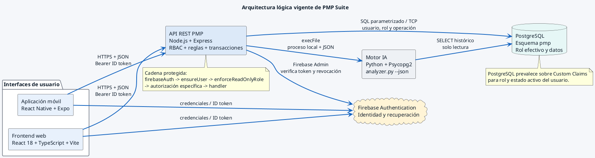

# Arquitectura lógica vigente de PMP Suite

Representa la Figura 1 del Documento de Diseño. Distingue la autenticación Firebase de la autorización efectiva basada en PostgreSQL y muestra que el analizador Python es invocado como proceso local por la API.

