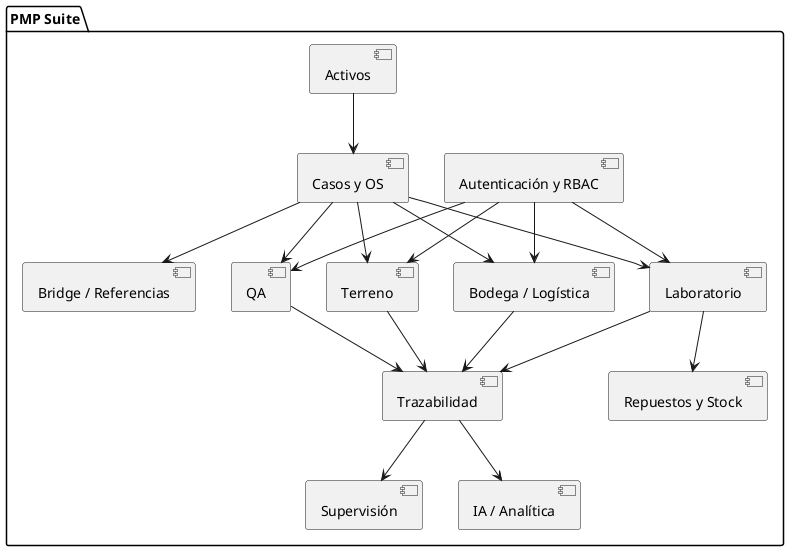

# 03 — Componentes principales

```plantuml
@startuml
package "PMP Suite" {
  [Autenticación y RBAC]
  [Activos]
  [Casos y OS]
  [Terreno]
  [Bodega / Logística]
  [Laboratorio]
  [QA]
  [Bridge / Referencias]
  [Repuestos y Stock]
  [Trazabilidad]
  [Supervisión]
  [IA / Analítica]
}
[Autenticación y RBAC] --> [Terreno]
[Autenticación y RBAC] --> [Bodega / Logística]
[Autenticación y RBAC] --> [Laboratorio]
[Autenticación y RBAC] --> [QA]
[Activos] --> [Casos y OS]
[Casos y OS] --> [Terreno]
[Casos y OS] --> [Bodega / Logística]
[Casos y OS] --> [Laboratorio]
[Casos y OS] --> [QA]
[Casos y OS] --> [Bridge / Referencias]
[Laboratorio] --> [Repuestos y Stock]
[Terreno] --> [Trazabilidad]
[Bodega / Logística] --> [Trazabilidad]
[Laboratorio] --> [Trazabilidad]
[QA] --> [Trazabilidad]
[Trazabilidad] --> [Supervisión]
[Trazabilidad] --> [IA / Analítica]
@enduml
```
