# Diagrama de componentes principales

Corresponde a la Figura 2 del Documento de Diseño y detalla la separación entre presentación, sesión, autorización, dominio, persistencia e inteligencia operacional.

```plantuml
@startuml PMP_Componentes
title Diagrama de componentes principales - PMP Suite

left to right direction
skinparam backgroundColor #F5F7FA
skinparam defaultFontName Arial
skinparam defaultFontColor #0D1B2A
skinparam componentStyle rectangle
skinparam ArrowColor #1565C0
skinparam ArrowThickness 2
skinparam packageBorderColor #6B7280
skinparam packageBackgroundColor #FFFFFF

package "Frontend web" #F7FAFD {
  [Páginas y componentes React] as WEB_UI
  [SessionContext] as SESSION
  [RBAC y rutas protegidas] as WEB_RBAC
  [Cliente Axios] as WEB_HTTP
  WEB_UI --> SESSION
  SESSION --> WEB_RBAC
  WEB_RBAC --> WEB_HTTP
}

package "Aplicación móvil" #F7FAFD {
  [Pantallas Expo] as MOB_UI
  [Firebase Client] as MOB_AUTH
  [Cliente Axios móvil] as MOB_HTTP
  MOB_UI --> MOB_AUTH
  MOB_UI --> MOB_HTTP
}

package "API Express" #EDF4FC {
  [Routers REST] as ROUTERS
  [firebaseAuth] as MW_FIREBASE
  [ensureUser] as MW_USER
  [enforceReadOnlyRole] as MW_READONLY
  [requireAnyRole / permisos] as MW_ROLE
  [Servicios de dominio y FSM] as DOMAIN
  [Transacciones y pool PG] as DATA
  [Adaptador IA execFile] as AI_ADAPTER

  ROUTERS --> MW_FIREBASE
  MW_FIREBASE --> MW_USER
  MW_USER --> MW_READONLY
  MW_READONLY --> MW_ROLE
  MW_ROLE --> DOMAIN
  DOMAIN --> DATA
  DOMAIN --> AI_ADAPTER
}

cloud "Firebase Authentication" as FIREBASE #FFF4D6
database "PostgreSQL / esquema pmp" as POSTGRES #E6F7F6
component "Analizador Python\nanalyzer.py" as PYTHON #EEF1F5

WEB_HTTP --> ROUTERS : HTTPS / JSON
MOB_HTTP --> ROUTERS : HTTPS / JSON
SESSION --> FIREBASE : sesión web
MOB_AUTH --> FIREBASE : sesión móvil
MW_FIREBASE --> FIREBASE : Admin SDK
DATA --> POSTGRES : SQL parametrizado
AI_ADAPTER --> PYTHON : proceso / JSON
PYTHON --> POSTGRES : consulta histórica
@enduml
```

