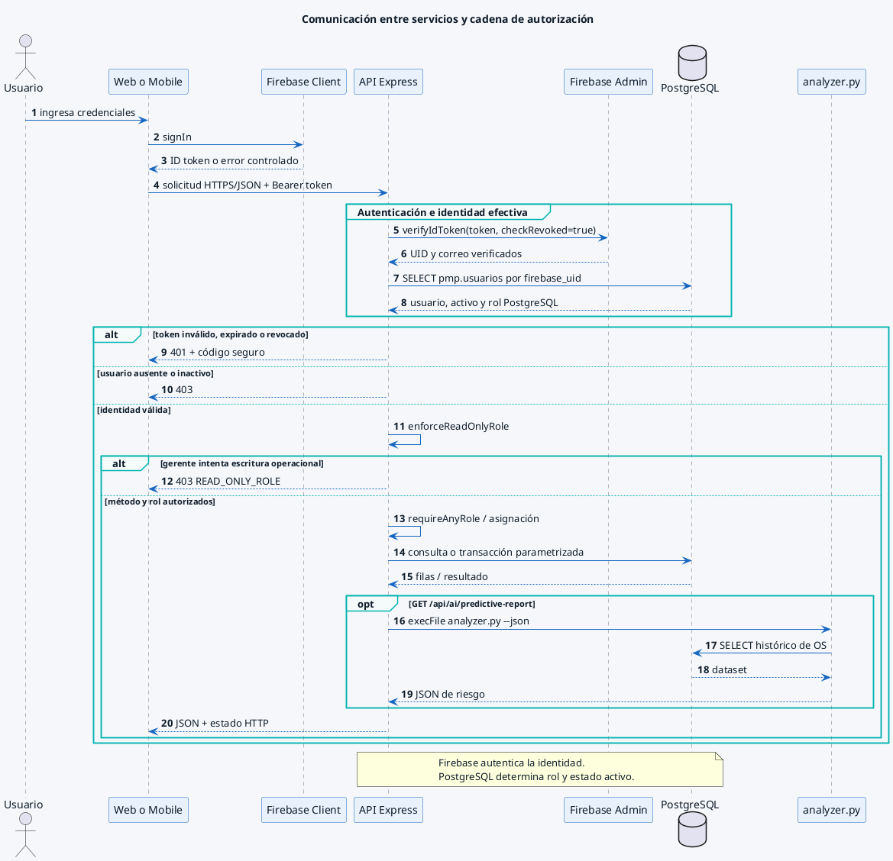

# Comunicación entre servicios y autorización

Complementa las secciones 4, 5.1 y 8 del Documento de Diseño. Muestra el recorrido de una solicitud protegida y la ejecución opcional del reporte IA.

