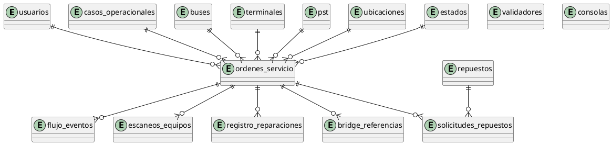

# 05 — Modelo de datos ERD simplificado

```plantuml
@startuml
entity usuarios
entity validadores
entity consolas
entity casos_operacionales
entity ordenes_servicio
entity flujo_eventos
entity escaneos_equipos
entity registro_reparaciones
entity bridge_referencias
entity repuestos
entity solicitudes_repuestos
entity buses
entity terminales
entity pst
entity ubicaciones
entity estados

usuarios ||--o{ ordenes_servicio
casos_operacionales ||--o{ ordenes_servicio
ordenes_servicio ||--o{ flujo_eventos
ordenes_servicio ||--o{ escaneos_equipos
ordenes_servicio ||--o{ registro_reparaciones
ordenes_servicio ||--o{ bridge_referencias
ordenes_servicio ||--o{ solicitudes_repuestos
repuestos ||--o{ solicitudes_repuestos
buses ||--o{ ordenes_servicio
terminales ||--o{ ordenes_servicio
pst ||--o{ ordenes_servicio
ubicaciones ||--o{ ordenes_servicio
estados ||--o{ ordenes_servicio
@enduml
```

La identidad del activo es lógica: `tipo + serie`, distribuida entre maestros de validadores y consolas.
