# Modelo de datos relacional - ERD histórico

> **FLUJO RETIRADO / HISTÓRICO.** La representación operacional de `bridges`/`bridge_mantenimiento` se conserva para interpretar datos anteriores; no autoriza nuevas operaciones Bridge. Para caso, OS, activo y referencia externa consultar la [adenda vigente](../../../02_Arquitectura/CASOS_REQUERIMIENTOS_DESPACHO.md) y el [índice documental](../README_VIGENCIA.md).

Corresponde a la Figura 3 del Documento de Diseño. El diagrama utiliza nombres reales del esquema `pmp` y sus relaciones vigentes. Se omiten columnas secundarias para mantener legibilidad, pero no se inventan tablas: la trazabilidad transversal reside en `flujo_eventos`.

```plantuml
@startuml PMP_ERD_Vigente
title Modelo de datos relacional - esquema pmp (vista consolidada)

left to right direction
hide circle
skinparam backgroundColor #F5F7FA
skinparam defaultFontName Arial
skinparam defaultFontColor #0D1B2A
skinparam ArrowColor #6B7280
skinparam linetype ortho
skinparam entity {
  BorderColor #1565C0
  BackgroundColor #FFFFFF
  FontColor #0D1B2A
}

entity "usuarios" as USUARIOS {
  * id : uuid <<PK>>
  --
  nombre : varchar
  apellido : varchar
  correo : varchar
  rol : varchar
  activo : boolean
  firebase_uid : varchar
}

entity "bridges" as BRIDGES {
  * codigo_bridge : varchar <<PK>>
  --
  estado : varchar
  origen : varchar
  sistema_externo : varchar?
  referencia_externa : varchar?
  tipo_equipo : varchar
  equipo_preparado_serie : varchar
  tecnico_terreno_id : uuid <<FK>>
  creado_por : uuid <<FK>>
  asignado_por : uuid <<FK>>
  equipo_retirado_serie : varchar?
  equipo_instalado_serie : varchar?
  resultado : varchar?
}

entity "bridge_mantenimiento" as VINCULO {
  * bridge_codigo : varchar <<PK, FK>>
  --
  codigo_os : varchar <<FK, UNIQUE>>
  creado_en : timestamptz
}

entity "ordenes_servicio" as OS {
  * codigo_os : varchar <<PK>>
  --
  fecha : timestamp
  tipo_equipo : varchar
  validador_serie : varchar? <<FK>>
  consola_serie : varchar? <<FK>>
  falla : text
  estado_id : int <<FK>>
  bus_ppu : varchar <<FK>>
  terminal_id : int <<FK>>
  pst_codigo : varchar <<FK>>
  ubicacion_id : int? <<FK>>
  tecnico_terreno_id : uuid? <<FK>>
  tecnico_laboratorio_id : uuid? <<FK>>
  qa_usuario_id : uuid? <<FK>>
}

entity "estados" as ESTADOS {
  * id : int <<PK>>
  --
  nombre : varchar
}

entity "config_estado_ubicacion" as ESTADO_UBICACION {
  * estado_id : int <<FK>>
  * tipo_ubicacion : enum
}

entity "ubicaciones" as UBICACIONES {
  * id : int <<PK>>
  --
  nombre : varchar
  tipo : enum
}

entity "validadores" as VALIDADORES {
  * serie : varchar <<PK>>
  --
  modelo : varchar
  marca : varchar?
}

entity "consolas" as CONSOLAS {
  * serie : varchar <<PK>>
  --
  modelo : varchar
  marca : varchar?
}

entity "buses" as BUSES {
  * ppu : varchar <<PK>>
}

entity "terminales" as TERMINALES {
  * id : int <<PK>>
  --
  nombre : varchar
}

entity "pst" as PST {
  * codigo : varchar <<PK>>
  --
  nombre : varchar
}

entity "terminal_pst" as TERMINAL_PST {
  * terminal_id : int <<FK>>
  * pst_codigo : varchar <<FK>>
}

entity "flujo_eventos" as EVENTOS {
  * id : bigint <<PK>>
  --
  bridge_codigo : varchar? <<FK>>
  codigo_os : varchar? <<FK>>
  tipo : varchar
  usuario_id : uuid <<FK>>
  rol : varchar
  fecha : timestamptz
  comentario : text?
  metadata : jsonb
}

entity "instalaciones_equipos" as INSTALACIONES {
  * id : uuid <<PK>>
  --
  bridge_codigo : varchar <<FK>>
  equipo_retirado_serie : varchar
  equipo_instalado_serie : varchar
  bus_ppu : varchar <<FK>>
  terminal_id : int <<FK>>
  pst_codigo : varchar <<FK>>
  tecnico_terreno_id : uuid <<FK>>
  intervencion_en : timestamptz
}

entity "registro_reparaciones" as REPARACIONES {
  * id : uuid <<PK>>
  --
  codigo_os : varchar? <<FK>>
  tecnico_id : uuid? <<FK>>
  falla_detectada : text?
  accion_realizada : text
  prueba_realizada : text?
  resultado_prueba : text?
}

entity "solicitudes_repuestos" as SOLICITUDES {
  * id : int <<PK>>
  --
  codigo_os : varchar <<FK>>
  solicitado_por : uuid <<FK>>
  estado : enum
  fecha_solicitud : timestamp
  repuesto_solicitado : varchar?
}

entity "solicitud_items" as ITEMS {
  * id : int <<PK>>
  --
  solicitud_id : int <<FK>>
  repuesto_id : int <<FK>>
  cantidad : int
}

entity "repuestos" as REPUESTOS {
  * id : int <<PK>>
  --
  nombre : varchar
  categoria : enum
  stock : int
  stock_critico : int
}

entity "qa_inspecciones" as QA_INSPECCIONES {
  * id : uuid <<PK>>
  --
  codigo_os : varchar <<FK>>
  qa_usuario_id : uuid <<FK>>
  resultado : varchar
  comentario : text?
  certificacion : text?
  fecha : timestamptz
}

entity "guias" as GUIAS {
  * numero : varchar <<PK>>
  --
  fecha : date
  origen_id : int <<FK>>
  destino_id : int <<FK>>
  creado_por : uuid? <<FK>>
}

entity "guia_detalle" as GUIA_DETALLE {
  * id : int <<PK>>
  --
  guia_numero : varchar <<FK>>
  tipo_equipo : varchar
  codigo_os : varchar? <<FK>>
  validador_serie : varchar? <<FK>>
  consola_serie : varchar? <<FK>>
  bus_ppu : varchar? <<FK>>
}

USUARIOS ||--o{ BRIDGES : crea / asigna / ejecuta
USUARIOS ||--o{ OS : roles operacionales
USUARIOS ||--o{ EVENTOS : registra
USUARIOS ||--o{ REPARACIONES : ejecuta
USUARIOS ||--o{ SOLICITUDES : solicita
USUARIOS ||--o{ QA_INSPECCIONES : certifica
USUARIOS ||--o{ GUIAS : crea

BRIDGES ||--o| VINCULO : genera
OS ||--o| VINCULO : queda vinculada
BRIDGES ||--o| INSTALACIONES : documenta
BRIDGES ||--o{ EVENTOS : produce
OS ||--o{ EVENTOS : produce

ESTADOS ||--o{ OS : estado actual
ESTADOS ||--o{ ESTADO_UBICACION : permite
UBICACIONES ||--o{ OS : ubicación actual
VALIDADORES ||--o{ OS : identifica validador
CONSOLAS ||--o{ OS : identifica consola
BUSES ||--o{ OS : bus
TERMINALES ||--o{ OS : terminal
PST ||--o{ OS : punto de servicio
TERMINALES ||--o{ TERMINAL_PST
PST ||--o{ TERMINAL_PST

OS ||--o{ REPARACIONES : historial técnico
OS ||--o{ SOLICITUDES : requiere
SOLICITUDES ||--o{ ITEMS : contiene
REPUESTOS ||--o{ ITEMS : referencia
OS ||--o{ QA_INSPECCIONES : historial QA

UBICACIONES ||--o{ GUIAS : origen / destino
GUIAS ||--o{ GUIA_DETALLE : contiene
OS ||--o{ GUIA_DETALLE : transporta
VALIDADORES ||--o{ GUIA_DETALLE
CONSOLAS ||--o{ GUIA_DETALLE
BUSES ||--o{ GUIA_DETALLE
@enduml
```

> Nota: `transiciones_estado` y `os_eventos` no existen como tablas en la línea base vigente. Las transiciones semánticas se validan en el backend y la evidencia transversal se registra en `flujo_eventos`.
