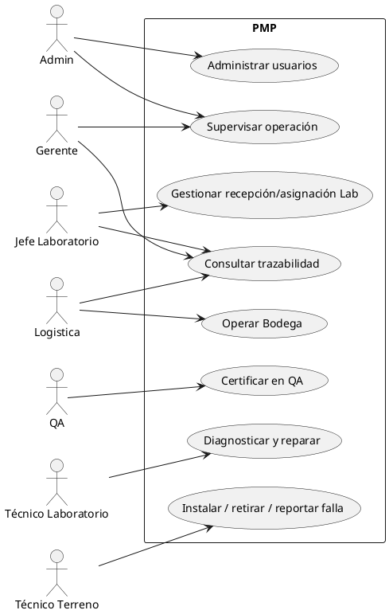

# 06 — Casos de uso principales

```plantuml
@startuml
left to right direction
actor Gerente
actor Admin
actor "Jefe Laboratorio" as Jefe
actor Logistica
actor QA
actor "Técnico Laboratorio" as TL
actor "Técnico Terreno" as TT

rectangle PMP {
  usecase "Supervisar operación" as U1
  usecase "Administrar usuarios" as U2
  usecase "Gestionar recepción/asignación Lab" as U3
  usecase "Operar Bodega" as U4
  usecase "Diagnosticar y reparar" as U5
  usecase "Certificar en QA" as U6
  usecase "Instalar / retirar / reportar falla" as U7
  usecase "Consultar trazabilidad" as U8
}
Gerente --> U1
Gerente --> U8
Admin --> U1
Admin --> U2
Jefe --> U3
Jefe --> U8
Logistica --> U4
Logistica --> U8
TL --> U5
TT --> U7
QA --> U6
@enduml
```
