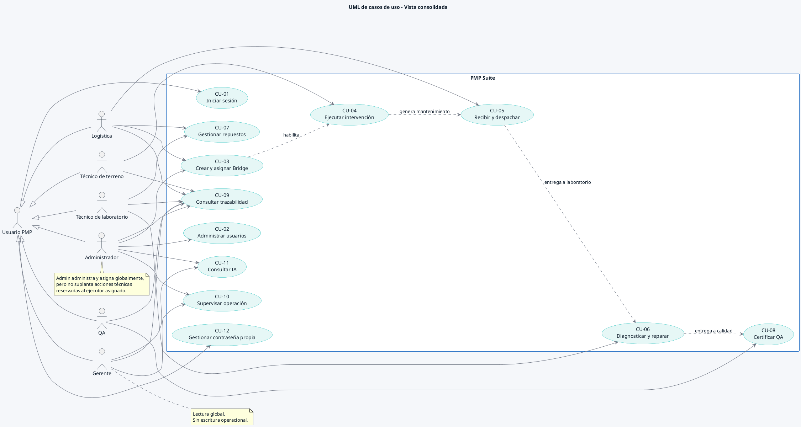

# UML de casos de uso consolidado

> **FLUJO RETIRADO / HISTÓRICO.** «Crear y asignar Bridge» pertenece a una versión retirada. Ingreso de requerimientos y despacho operan las OS; Bridge solo mantiene correlaciones. Consultar la [adenda vigente](../../../02_Arquitectura/CASOS_REQUERIMIENTOS_DESPACHO.md) y el [índice documental](../README_VIGENCIA.md).

Fuente compartida para la Figura 1 del SRS y la Figura 4 del Documento de Diseño. Incluye los doce casos de uso definidos en la especificación y los seis roles oficiales.

