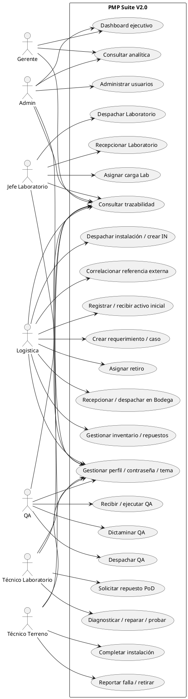

# 06 — UML Casos de Uso V2.0

```plantuml
@startuml
left to right direction
actor Gerente
actor Admin
actor "Jefe Laboratorio" as JL
actor Logistica
actor QA
actor "Técnico Laboratorio" as TL
actor "Técnico Terreno" as TT

rectangle "PMP Suite V2.0" {
 usecase "Dashboard ejecutivo" as U01
 usecase "Administrar usuarios" as U02
 usecase "Registrar / recibir activo inicial" as U03
 usecase "Crear requerimiento / caso" as U04
 usecase "Asignar retiro" as U05
 usecase "Reportar falla / retirar" as U06
 usecase "Recepcionar / despachar en Bodega" as U07
 usecase "Gestionar inventario / repuestos" as U08
 usecase "Recepcionar Laboratorio" as U09
 usecase "Asignar carga Lab" as U10
 usecase "Diagnosticar / reparar / probar" as U11
 usecase "Solicitar repuesto PoD" as U12
 usecase "Despachar Laboratorio" as U13
 usecase "Recibir / ejecutar QA" as U14
 usecase "Dictaminar QA" as U15
 usecase "Despachar QA" as U16
 usecase "Despachar instalación / crear IN" as U17
 usecase "Completar instalación" as U18
 usecase "Consultar trazabilidad" as U19
 usecase "Correlacionar referencia externa" as U20
 usecase "Consultar analítica" as U21
 usecase "Gestionar perfil / contraseña / tema" as U22
}

Gerente --> U01
Gerente --> U19
Gerente --> U21

Admin --> U01
Admin --> U02
Admin --> U19
Admin --> U21

Logistica --> U03
Logistica --> U04
Logistica --> U05
Logistica --> U07
Logistica --> U08
Logistica --> U17
Logistica --> U20
Logistica --> U19

JL --> U09
JL --> U10
JL --> U13
JL --> U19

TL --> U11
TL --> U12
TL --> U19

QA --> U14
QA --> U15
QA --> U16
QA --> U19

TT --> U06
TT --> U18
TT --> U19

Admin --> U22
JL --> U22
Logistica --> U22
QA --> U22
TL --> U22
TT --> U22
@enduml
```

El detalle de precondiciones, flujo normal, alternativas y errores se encuentra en `Documentacion Capstone/06_CASOS_DE_USO_Y_ESCENARIOS_V2.0.md`.
