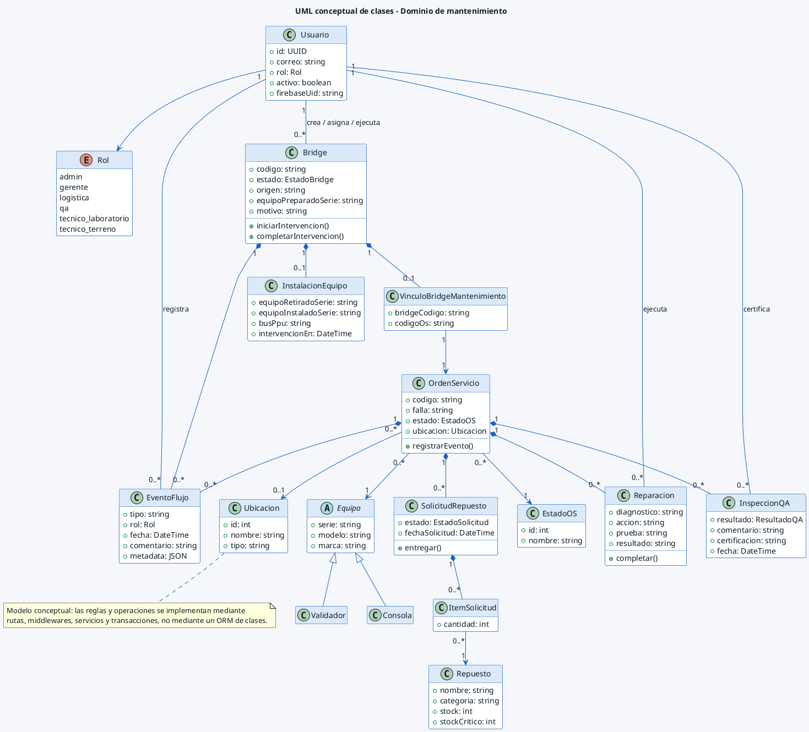

# UML conceptual de clases del dominio

> **FLUJO RETIRADO / HISTÓRICO.** Las responsabilidades operativas atribuidas a Bridge describen la versión anterior y se conservan como evidencia. El modelo vigente separa caso, OS, activo físico y referencia externa: [adenda funcional y técnica](../../../02_Arquitectura/CASOS_REQUERIMIENTOS_DESPACHO.md), [índice documental](../README_VIGENCIA.md).

Corresponde a la Figura 5 del Documento de Diseño. Es un modelo conceptual: las clases representan conceptos y responsabilidades del dominio, no clases ejecutables equivalentes uno a uno en Express.

