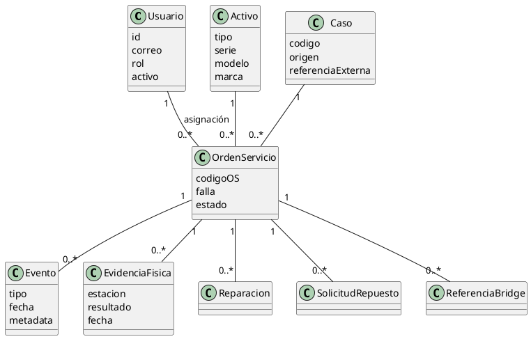

# 07 — Clases conceptuales

```plantuml
@startuml
class Usuario {
  id
  correo
  rol
  activo
}
class Activo {
  tipo
  serie
  modelo
  marca
}
class Caso {
  codigo
  origen
  referenciaExterna
}
class OrdenServicio {
  codigoOS
  falla
  estado
}
class Evento {
  tipo
  fecha
  metadata
}
class EvidenciaFisica {
  estacion
  resultado
  fecha
}
class Reparacion
class SolicitudRepuesto
class ReferenciaBridge

Caso "1" -- "0..*" OrdenServicio
Activo "1" -- "0..*" OrdenServicio
OrdenServicio "1" -- "0..*" Evento
OrdenServicio "1" -- "0..*" EvidenciaFisica
OrdenServicio "1" -- "0..*" Reparacion
OrdenServicio "1" -- "0..*" SolicitudRepuesto
OrdenServicio "1" -- "0..*" ReferenciaBridge
Usuario "1" -- "0..*" OrdenServicio : asignación
@enduml
```
