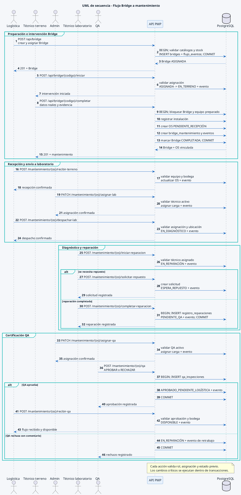

# UML de secuencia - Bridge a mantenimiento, laboratorio y QA

> **FLUJO RETIRADO / HISTÓRICO.** Esta secuencia no debe ejecutarse ni presentarse como comportamiento vigente. Los endpoints operacionales Bridge se retiraron y responden 410. Ingreso de requerimientos crea OS y el despacho físico confirmado crea IN; Bridge solo correlaciona. Consultar los flujos de la [adenda vigente](../../../02_Arquitectura/CASOS_REQUERIMIENTOS_DESPACHO.md) y el [índice documental](../README_VIGENCIA.md).

Corresponde a la Figura 6 del Documento de Diseño y al flujo principal descrito por CU-04, CU-05, CU-06 y CU-08. Los nombres de las acciones coinciden con las rutas semánticas vigentes del backend.

