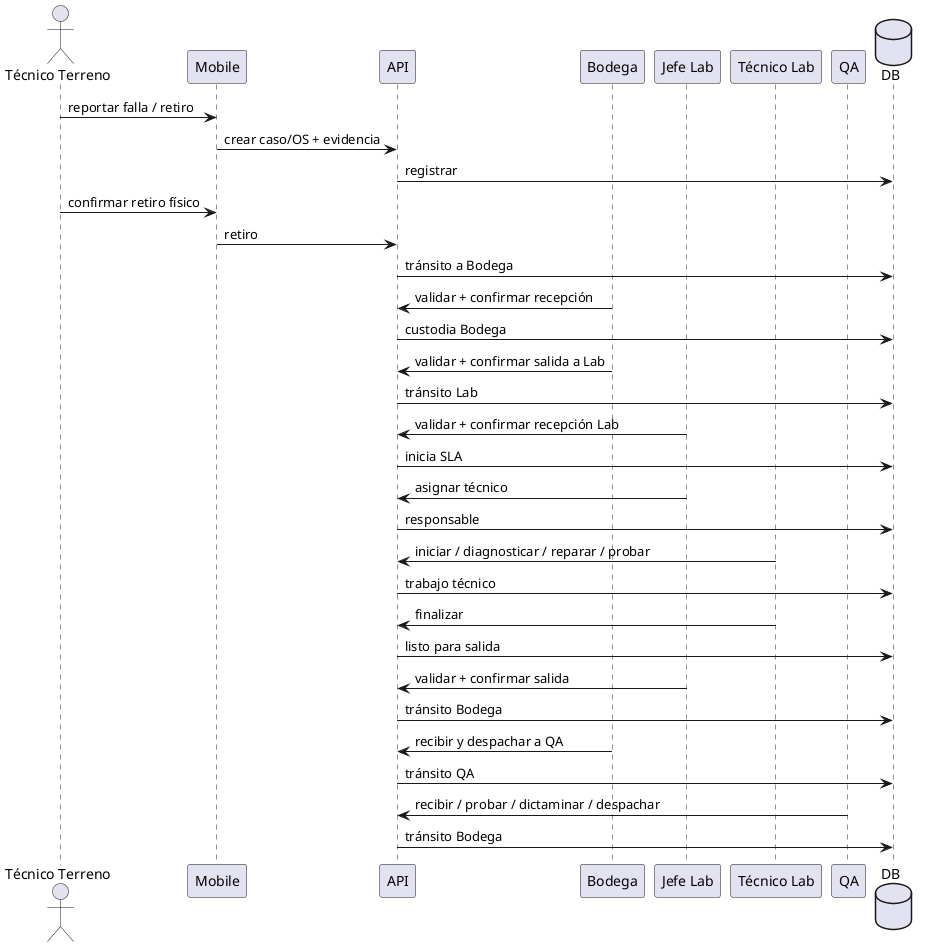

# 08 — Secuencia principal de mantenimiento

```plantuml
@startuml
actor "Técnico Terreno" as TT
participant Mobile
participant API
participant Bodega
participant "Jefe Lab" as JL
participant "Técnico Lab" as TL
participant QA
database DB

TT -> Mobile : reportar falla / retiro
Mobile -> API : crear caso/OS + evidencia
API -> DB : registrar
TT -> Mobile : confirmar retiro físico
Mobile -> API : retiro
API -> DB : tránsito a Bodega

Bodega -> API : validar + confirmar recepción
API -> DB : custodia Bodega
Bodega -> API : validar + confirmar salida a Lab
API -> DB : tránsito Lab

JL -> API : validar + confirmar recepción Lab
API -> DB : inicia SLA
JL -> API : asignar técnico
API -> DB : responsable
TL -> API : iniciar / diagnosticar / reparar / probar
API -> DB : trabajo técnico
TL -> API : finalizar
API -> DB : listo para salida

JL -> API : validar + confirmar salida
API -> DB : tránsito Bodega
Bodega -> API : recibir y despachar a QA
API -> DB : tránsito QA
QA -> API : recibir / probar / dictaminar / despachar
API -> DB : tránsito Bodega
@enduml
```
