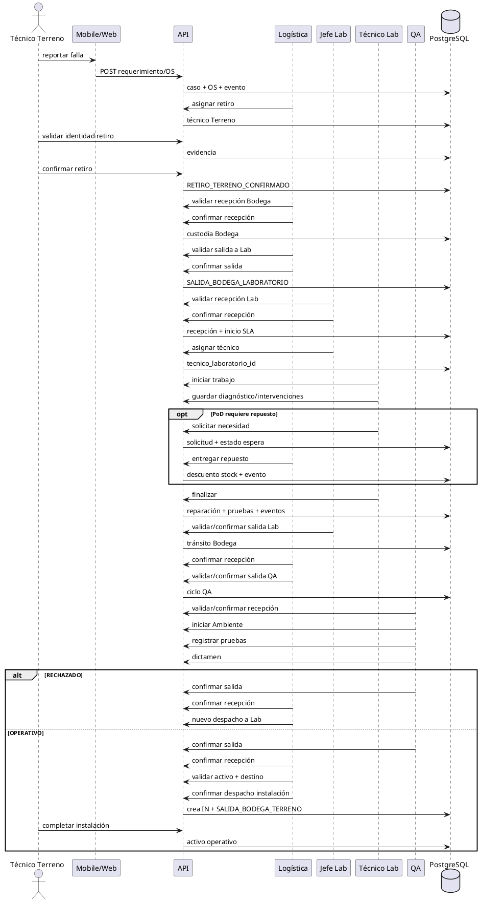

# 08 — Secuencia End-to-End V2.0

```plantuml
@startuml
actor "Técnico Terreno" as TT
participant "Mobile/Web" as UI
participant API
participant "Logística" as B
participant "Jefe Lab" as JL
participant "Técnico Lab" as TL
participant QA
database PostgreSQL as DB

TT -> UI : reportar falla
UI -> API : POST requerimiento/OS
API -> DB : caso + OS + evento

B -> API : asignar retiro
API -> DB : técnico Terreno

TT -> API : validar identidad retiro
API -> DB : evidencia
TT -> API : confirmar retiro
API -> DB : RETIRO_TERRENO_CONFIRMADO

B -> API : validar recepción Bodega
B -> API : confirmar recepción
API -> DB : custodia Bodega

B -> API : validar salida a Lab
B -> API : confirmar salida
API -> DB : SALIDA_BODEGA_LABORATORIO

JL -> API : validar recepción Lab
JL -> API : confirmar recepción
API -> DB : recepción + inicio SLA
JL -> API : asignar técnico
API -> DB : tecnico_laboratorio_id

TL -> API : iniciar trabajo
TL -> API : guardar diagnóstico/intervenciones
opt PoD requiere repuesto
 TL -> API : solicitar necesidad
 API -> DB : solicitud + estado espera
 B -> API : entregar repuesto
 API -> DB : descuento stock + evento
end
TL -> API : finalizar
API -> DB : reparación + pruebas + eventos

JL -> API : validar/confirmar salida Lab
API -> DB : tránsito Bodega

B -> API : confirmar recepción
B -> API : validar/confirmar salida QA
API -> DB : ciclo QA

QA -> API : validar/confirmar recepción
QA -> API : iniciar Ambiente
QA -> API : registrar pruebas
QA -> API : dictamen
alt RECHAZADO
 QA -> API : confirmar salida
 B -> API : confirmar recepción
 B -> API : nuevo despacho a Lab
else OPERATIVO
 QA -> API : confirmar salida
 B -> API : confirmar recepción
 B -> API : validar activo + destino
 B -> API : confirmar despacho instalación
 API -> DB : crea IN + SALIDA_BODEGA_TERRENO
 TT -> API : completar instalación
 API -> DB : activo operativo
end
@enduml
```

Principio: cada `validar` y `confirmar` es una operación distinta; la primera no cambia custodia.
