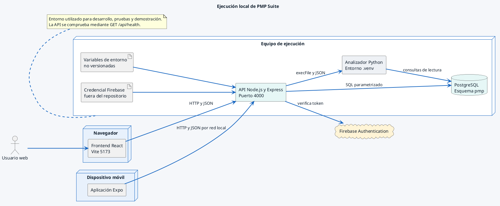

# Ejecución local de PMP Suite

Corresponde a la Figura 7 del Documento de Diseño y a la sección de ejecución
del Manual Técnico. Representa el entorno utilizado para la validación y
demostración Capstone.

