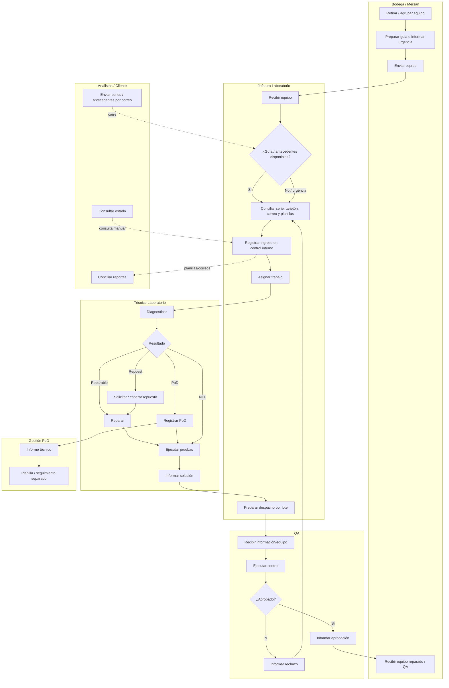

# BPMN AS-IS — Proceso actual previo a PMP Suite

**Versión:** V2.0  
**Ámbito principal:** Laboratorio de Garantías y coordinación con áreas relacionadas.

## 1. Objetivo

Representar el proceso previo a la centralización, incluyendo canales paralelos, registros manuales y puntos de conciliación.

## 2. Pools/Lanes

**Pool: Proceso de mantenimiento actual**

- Bodega/Mersan
- Laboratorio/Jefatura
- Técnico Laboratorio
- QA
- Analistas/Cliente
- Gestión PoD

## 3. Flujo AS-IS

## 4. Gateways y excepciones

### G1 — Documentación de ingreso

Puede existir guía, información parcial o ingreso urgente. Esto obliga a conciliar antecedentes manualmente.

### G2 — Diagnóstico

Resultados posibles:

- falla confirmada;
- falla diferente;
- NFF;
- PoD;
- necesidad de repuesto;
- otro diagnóstico técnico.

### G3 — QA

QA puede aprobar o rechazar. Un rechazo provoca reingreso al circuito técnico y nueva conciliación.

## 5. Puntos de dolor AS-IS

| Punto | Problema |
|---|---|
| Recepción | guía/tarjetón/correo pueden llegar desfasados |
| Identidad | la serie puede aparecer en registros distintos |
| Registro | múltiples planillas sin sincronización |
| Custodia | difícil distinguir tránsito de recepción real |
| Asignación | seguimiento manual de carga |
| Reparación | antecedentes técnicos distribuidos |
| Repuestos | coordinación separada |
| PoD | informe/planilla paralela |
| QA | resultados en otro registro |
| Despacho | lotes y fechas no necesariamente alineados a una única fuente |
| Consulta | reconstrucción manual ante preguntas de estado |

## 6. Riesgos

- error de identidad;
- pérdida de trazabilidad;
- doble digitación;
- estados inconsistentes;
- demora en conciliación;
- decisiones con información incompleta;
- evidencia física no asociada al movimiento exacto.
