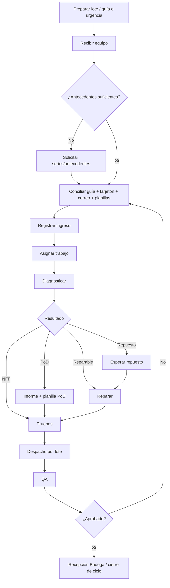

# BPMN AS-IS — Proceso actual previo a PMP Suite

**Versión:** V2.0  
**Ámbito principal:** Laboratorio de Garantías y coordinación con áreas relacionadas.

## 1. Objetivo

Representar el proceso real previo a la centralización, incluyendo entradas documentales desfasadas, registros paralelos, conciliaciones manuales, PoD y QA.

## 2. Pool y lanes

**Pool conceptual:** Proceso de mantenimiento AS-IS.

1. Bodega / Mersan.
2. Jefatura Laboratorio.
3. Técnico Laboratorio.
4. QA.
5. Analistas / Cliente.
6. Gestión PoD.

El archivo `BPMN_AS_IS_V2.0.bpmn` contiene las mismas seis lanes y puede abrirse en un modelador BPMN 2.0.

## 3. Flujo nominal

1. Bodega/Mersan prepara lote y antecedentes.
2. Si existe guía, se prepara; en urgencias el equipo puede enviarse antes de la documentación formal y las series/antecedentes circulan por correo.
3. Jefatura recibe el equipo físico.
4. Se valida si los antecedentes son suficientes.
5. Cuando faltan datos, se solicita información a analistas/cliente.
6. Se concilian guía, tarjetón, correo y planillas.
7. Se registra el ingreso en el control interno de Laboratorio.
8. Jefatura asigna el trabajo.
9. Técnico diagnostica.
10. Según diagnóstico: reparación, espera de repuesto, NFF o PoD.
11. Si existe PoD, se genera informe técnico y seguimiento paralelo.
12. Se ejecutan pruebas.
13. Se registra/informa solución.
14. Jefatura prepara despacho por lote.
15. QA controla.
16. Si QA rechaza, el caso reingresa a conciliación/trabajo técnico; si aprueba, Bodega recibe el equipo.

## 4. Gateways

| Gateway | Condiciones |
|---|---|
| ¿Guía disponible? | Sí / No-urgencia |
| ¿Antecedentes suficientes? | Sí / incompletos |
| Resultado diagnóstico | Reparable, falla diferente, repuesto, PoD, NFF |
| ¿QA aprobado? | Aprobado / rechazado |

## 5. Excepciones reales

- equipo recibido sin guía formal;
- serie comunicada por correo;
- tarjetón faltante;
- tarjetón/dato incompatible;
- necesidad de repuesto;
- PoD;
- NFF;
- rechazo QA;
- consultas manuales de estado durante el ciclo;
- despachos en lotes distintos al día de reparación.

## 6. Fragmentación de información

La misma serie puede aparecer en registros independientes de Mersan/Bodega, Laboratorio, QA, analistas y gestión PoD. El proceso requiere conciliación manual y depende de correos, guía, tarjetón y conocimiento operativo.

## 7. Dolor operacional

| Dimensión | Consecuencia |
|---|---|
| Identidad | riesgo de discrepancia entre equipo y antecedente |
| Custodia | tránsito y recepción pueden confundirse |
| Estado | distintas planillas pueden mostrar estados diferentes |
| SLA | difícil fijar inicio real de permanencia |
| Repuestos | coordinación fuera del registro técnico |
| PoD | informe y seguimiento paralelo |
| QA | rechazo/aprobación en otra fuente |
| Consulta | reconstrucción manual ante requerimientos del cliente |
| Historial | reincidencia por serie exige unir múltiples registros |

## 8. Diagrama de lectura rápida

## 9. Relación con problemática

Este BPMN explica por qué PMP Suite prioriza identidad física, custodia por evidencia, eventos append-only, roles segregados y una única fuente operacional.
