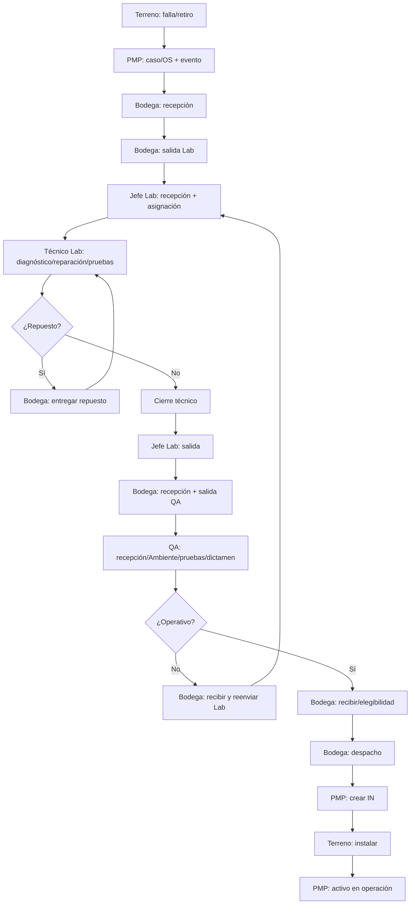

# BPMN TO-BE — PMP Suite V2.0

**Versión:** V2.0

## 1. Objetivo

Representar el proceso integrado objetivo soportado por PMP Suite, desde falla/retiro hasta reparación, QA, retorno a Bodega y nueva instalación, aplicando Physical First.

## 2. Pool y lanes

**Pool conceptual:** Proceso integrado PMP Suite.

1. Técnico Terreno.
2. Logística / Bodega.
3. Jefe Laboratorio.
4. Técnico Laboratorio.
5. QA.
6. Sistema PMP Suite.

Admin y Gerencia son observadores/autorizados de consulta; no constituyen una lane operacional porque no ejecutan movimientos físicos.

El archivo `BPMN_TO_BE_V2.0.bpmn` contiene las mismas seis lanes.

## 3. Flujo principal

1. Técnico Terreno reporta falla.
2. PMP crea caso/OS y conserva identidad del activo.
3. Terreno valida y confirma retiro físico.
4. PMP registra tránsito a Bodega.
5. Logística valida y confirma recepción.
6. PMP registra custodia Bodega.
7. Logística valida y confirma salida a Laboratorio.
8. PMP abre ciclo Lab.
9. Jefe Lab confirma recepción; PMP inicia SLA.
10. Jefe Lab asigna técnico.
11. Técnico diagnostica.
12. Si requiere repuesto PoD, solicita necesidad; Logística selecciona/entrega y PMP descuenta stock al confirmar entrega.
13. Técnico repara/interviene.
14. Ejecuta pruebas Manual/Test MK.
15. Si la prueba falla vuelve a reparación; si aprueba finaliza trabajo.
16. PMP marca el equipo listo para salida.
17. Jefe Lab valida y confirma salida.
18. Bodega recibe y luego despacha a QA.
19. PMP abre ciclo QA.
20. QA confirma recepción, registra Instalación Ambiente, pruebas y dictamen.
21. Si rechaza: QA sale, Bodega recibe y genera nuevo ciclo Bodega→Lab.
22. Si queda Operativo: QA sale, Bodega recibe y PMP evalúa elegibilidad.
23. Logística valida y confirma despacho a Terreno.
24. PMP crea la IN y SALIDA_BODEGA_TERRENO atómicamente.
25. Terreno completa instalación.
26. PMP registra activo en operación.

## 4. Gateways y reglas

| Gateway | Regla |
|---|---|
| ¿Requiere repuesto? | técnico describe necesidad; no administra inventario |
| ¿Pruebas Lab aprobadas? | cierre solo con pruebas válidas |
| ¿QA operativo? | rechazo inicia nuevo ciclo físico; operativo sigue a stock |
| Elegibilidad | Bodega + origen de stock vigente + sin intervención incompatible |

### Physical First

Validar identidad/contexto **no** mueve custodia. Cada entrada y salida requiere confirmación propia.

### Evidencia por movimiento

La evidencia de recepción no sirve para salida; la de un ciclo anterior no sirve para el siguiente.

### Roles

- Logística: Bodega, stock, repuestos y movimientos.
- Jefe Lab: custodia/asignación/supervisión Lab.
- Técnico Lab: trabajo técnico de su carga.
- QA: operación autónoma QA.
- Terreno: retiro/instalación propia.
- Admin/Gerencia: consulta/supervisión según RBAC, sin ejecutar custodia.

## 5. Eventos/efectos de sistema relevantes

- REQUERIMIENTO_INGRESADO.
- RETIRO_TERRENO_CONFIRMADO.
- SALIDA_BODEGA_LABORATORIO.
- RECEPCION_LABORATORIO_CONFIRMADA.
- LAB_TRABAJO_INICIADO / avances / diagnóstico / finalización.
- LOGISTICA_ENTREGA_REPUESTO.
- SALIDA_LABORATORIO_BODEGA.
- ciclo QA + dictamen + salida.
- SALIDA_BODEGA_TERRENO.
- INSTALACION_COMPLETADA.

## 6. Mejoras respecto del AS-IS

| AS-IS | TO-BE |
|---|---|
| planillas separadas | PostgreSQL + read models centralizados |
| conciliación manual de identidad | tipo+serie y resolución de identificador |
| tránsito/recepción ambiguos | validación + confirmación por movimiento |
| asignación informal | Jefe Lab + carga por técnico |
| inventario mezclado con reparación | Bodega administra stock |
| QA y despacho acoplados | dictamen y salida separados |
| reingreso sin ciclo explícito | nuevo ciclo físico con evidencia nueva |
| consulta por correo | trazabilidad, búsqueda y dashboards |
| historial reconstruido manualmente | eventos + historial por activo |
| instalación anticipada | IN creada solo al confirmar despacho |

## 7. Diagrama de lectura rápida

## 8. Supervisión

Admin y Gerencia consultan dashboards, OS, trazabilidad y reportes autorizados sin alterar el flujo.
