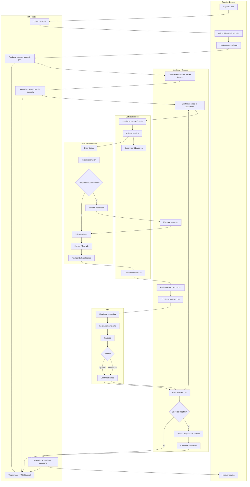

# BPMN TO-BE — PMP Suite V2.0

**Versión:** V2.0

## 1. Objetivo

Representar el flujo integrado con PMP Suite, manteniendo separación de responsabilidades y custodia Physical First.

## 2. Pools/Lanes

- Técnico Terreno
- Logística/Bodega
- Jefe Laboratorio
- Técnico Laboratorio
- QA
- Sistema PMP Suite
- Admin/Gerencia (supervisión)

## 3. Flujo principal TO-BE

## 4. Reglas BPMN TO-BE

### R1 — Validar ≠ confirmar

El sistema puede validar identidad/contexto sin cambiar la custodia. La transición se registra únicamente con confirmación explícita.

### R2 — Evidencia por movimiento

La evidencia de recepción no puede reutilizarse para despacho. Cada ciclo genera su propia evidencia.

### R3 — Laboratorio

- Jefe Laboratorio: recepción, asignación, supervisión y salida.
- Técnico: trabajo técnico de su carga.
- Técnico no administra stock.

### R4 — QA

QA inicia/toma su propio trabajo. Dictamen y despacho son acciones separadas.

### R5 — Instalación

La OS IN nace al confirmar el despacho desde Bodega a Terreno, no al seleccionar técnico o serie.

### R6 — Reingresos

Un rechazo QA retorna al circuito Bodega → Laboratorio con un nuevo ciclo físico. No hereda evidencia anterior.

## 5. Mejoras frente al AS-IS

| AS-IS | TO-BE |
|---|---|
| planillas por área | PostgreSQL central |
| conciliación de serie manual | identidad tipo + serie |
| estado ambiguo | custodia derivada de eventos/evidencia |
| correo como contexto principal | caso/OS/historial |
| asignación informal | carga asignada y RBAC |
| reparación y stock mezclables | responsabilidades separadas |
| QA y despacho acoplados | etapas QA + salida física |
| trazabilidad reconstruida | eventos append-only |
| consulta manual | dashboards, historial, búsqueda |
